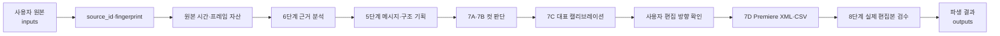

# 프로젝트 전체 구조 분석 보고서

- 작성일: 2026-07-18
- 상태: active / supporting analysis — 현재 구조 분석 기준 문서이며 실행·상태 정본은 아님
- 분석 대상: 현재 활성 루트, 기존 영상 제작 프레임워크 백업, 최근 재구축 실험 스냅샷
- 분석 목적: 기존 기능을 잃지 않으면서 최소 구조로 점진 재구축하기 위한 전체 구조 파악

## 1. 결론 요약

현재 프로젝트는 하나의 완성된 실행 시스템이 아니라 다음 세 계층으로 나뉘어 있다.

1. **현재 활성 제어층**  
   루트에는 규칙, 현재 상태, 재구축 계획, 승계 지도와 Git 경계 설정만 있다. 실행 코드,
   활성 스킬, 활성 테스트는 아직 없다. 현재 단계는 실제 구현 전의 안전한 출발점이다.
2. **기존 기능 프레임워크**  
   `backup/`에는 실제 영상 제작을 위해 누적된 1~8단계 워크플로우, 도구, 스킬, 테스트,
   품질 기준이 보존되어 있다. 프로젝트의 기능적 정체성은 주로 이 계층에 있다.
3. **최근 재구축 실험 스냅샷**  
   `backup/root_snapshot_2026-07-18/`에는 Python 패키지, CLI, SQLite 상태 저장소, 도메인
   계층, CI와 대규모 테스트를 도입했던 전면 재구축 결과가 있다. 안전 검사와 일부 어댑터는
   유용하지만 전체 구조는 현재 규모에 비해 과도하다.

따라서 올바른 재구축 방향은 어느 한 계층을 통째로 복원하는 것이 아니다. 기존 기능
프레임워크를 동작 기준선으로 삼고, 최근 스냅샷에서는 실제 문제를 해결한 코드만 회수해야 한다.
현재 루트는 이 선택적 승계를 진행하기에 적절한 최소 상태다.

## 2. 분석 범위와 데이터 경계

이번 분석에서 확인한 범위는 다음과 같다.

- 현재 루트의 운영 문서와 Git 설정
- `backup/`의 공용 규칙, 워크플로우, 문서, 도구, 스킬, 테스트
- Claude·GPT·Gemini가 작성한 구조 진단과 교차검증 문서
- `backup/root_snapshot_2026-07-18/`의 패키지 구조, 테스트 구조, 단계 보고서와 실행 설정

`inputs/`와 `outputs/`는 `PROJECT_RULES.md`상 사용자 작업 데이터다. 이번 요청에서는 특정
원본이나 결과 파일이 지정되지 않았으므로 내부 파일·내용·해시·결과 품질은 조사하지 않았다.
따라서 이 문서는 **프로젝트 프레임워크 전체 구조 분석**이며, 개별 사용자 원본과 기존 제작
결과물의 완전성 감사는 포함하지 않는다.

`backup/`은 전 과정에서 읽기 전용 기준선으로 취급한다.

## 3. 현재 물리 구조

```text
김실버유튜브/
├─ AGENTS.md                         에이전트 시작 순서
├─ PROJECT_RULES.md                  운영 규칙 단일 정본
├─ SESSION_HANDOFF.md                현재 단계와 첫 다음 행동
├─ PROJECT_STRUCTURE_ANALYSIS.md     이 구조 분석 보고서
├─ .gitattributes                    줄바꿈·바이너리 판정
├─ .gitignore                        사용자 데이터·캐시·스냅샷 제외
├─ .agents/                          현재 비어 있는 에이전트 설정 영역
├─ docs/
│  ├─ REBUILD_PLAN.md                3단계 점진 재구축 계획
│  └─ INHERITANCE_MAP.md             기존 자산 승계 판단 정본
└─ backup/                           읽기 전용 보존 영역
   ├─ 기존 루트 제어 문서
   ├─ docs/                           기존 설계·품질·워크플로우 계약
   ├─ tools/                          기존 실행 도구와 미디어 바이너리
   ├─ skills/                         1~8단계 및 보조 스킬
   ├─ tests/                          기존 기능 회귀 테스트
   ├─ planning_research/              운영 진단과 기획 단계 연구
   ├─ claude/, gpt/, gemini/          모델별 구조 진단·교차검증 자료
   └─ root_snapshot_2026-07-18/       최근 전면 재구축 실험 전체 스냅샷
```

현재 활성 루트에는 `src/`, `tools/`, `skills/`, `tests/`가 없다. 즉 현재 문서는 실행 가능한
프로젝트라고 주장하지 않으며, `SESSION_HANDOFF.md`에 기록된 것처럼 1단계 대표 파일 작업을
선정하기 전 상태다.

## 4. 구조별 소유권과 정본

| 영역 | 역할 | 현재 판단 |
|---|---|---|
| `PROJECT_RULES.md` | 안전·품질·변경 규칙 | 유일한 규칙 정본 |
| `SESSION_HANDOFF.md` | 현재 단계, 다음 행동, 대기 결정 | 현재 상태 정본 |
| `docs/REBUILD_PLAN.md` | 단계별 실행 범위와 완료 기준 | 재구축 계획 정본 |
| `docs/INHERITANCE_MAP.md` | 기존 자산의 유지·단순화·보류·제외 판단 | 승계 결정 정본 |
| `backup/` | 기존 기능과 과거 판단의 증거 | 읽기 전용 참고 원본 |
| `inputs/` | 사용자 원본 자료 | 사용자 작업 데이터, 원본 보호 |
| `outputs/` | 파생 결과와 영상별 상태 | 사용자 작업 데이터, 원본과 분리 |
| 향후 `tools/`, `skills/`, `tests/` | 실제 사용하는 공용 기능 | 현재 단계에서 필요한 것만 복원 |

정본 관계는 다음과 같다.


이 구조는 시작 문맥을 작게 유지한다는 장점이 있다. 반대로 실행 기능을 복원한 뒤에도
`README`, 문서 라우터, 실행 진입점이 없으면 새 작업자가 실제 사용법을 찾기 어렵다. 이들은
1단계 대표 작업이 정해진 뒤 필요한 범위에서만 추가해야 한다.

## 5. 기존 영상 제작 프레임워크 분석

### 5.1 핵심 기능 구조

기존 체계의 중심은 `backup/01_youtube_production_workflow.md`의 8단계 제작 흐름이다.

| 단계 | 기존 스킬 | 핵심 책임 |
|---:|---|---|
| 1 | `game-trend-research` | 소재 수요와 경쟁 환경 조사 |
| 2 | `youtube-channel-planning` | 채널 관점·콘셉트·클릭 이유 설계 |
| 3 | `youtube-script-planning` | 주장 흐름·장면 목적·대본 구조 설계 |
| 4 | `subtitle-cleanup` | 원문 보존, 자막 정리, 타이밍 신뢰도 표시 |
| 5 | `dialogue-based-planning` | 승인된 분석을 중심 메시지와 이야기 구조로 변환 |
| 6 | `gameplay-video-analysis` | 사건·화면·음성·반응·반증 근거 지도 작성 |
| 7 | `premiere-editing-export` | microbeat 판단, 경계 검증, Premiere 자료 생성 |
| 8 | `final-video-review` | 실제 편집본과 기획·원본 근거의 최종 검수 |

촬영 전 콘텐츠는 `1→2→3→4→6→5→7→8`, 촬영 완료본은 자막 신뢰 확인 후
`6→5→7→8`로 진행하는 것이 현재 승계 기준이다. 6단계 분석이 5단계 영상 기획보다 먼저인
이유는 편집 구상을 원본 근거보다 먼저 확정하지 않기 위해서다.

7단계는 단순 XML 생성이 아니라 다음 네 단계로 분해되어 있다.

- 7A: 후보 범위가 이야기에서 하는 역할 해석
- 7B: 유지·압축·제거할 microbeat와 실제 컷 경계 검증
- 7C: 초반·중간·후반 대표 구간 캘리브레이션
- 7D: 사용자 편집 방향 확인 뒤 전체 범위 확장

이 순서와 사용자 판단 지점은 프로젝트의 기능적 핵심이므로 유지해야 한다. 다만 모든 상태를
기계식 전환 그래프로 강제할 필요는 없다.

### 5.2 기존 도구 계층

| 도구군 | 주요 자산 | 역할 | 분석 판단 |
|---|---|---|---|
| 실행 환경 | `run_python.bat`, `git_project.bat` | Windows 실행 경로와 Git 안전 경로 처리 | 실패 코드 보존을 고쳐 승계 |
| 미디어 런타임 | FFmpeg, ffprobe, ffplay | probe, 프레임 추출, 변환, 검증 | 필요한 실행 파일과 버전 정보 승계 |
| 원본 자산 | `source_frame_assets.py`, `register_source_assets.py` | 안정된 소스 ID, 원본 시간·프레임 자산, 재사용 | 핵심 필드를 줄여 필수 승계 |
| 자막·경계 | `synccheck/` | VAD, 자막 정렬, 말 중간 컷 위험 제안 | 판단 도구가 아닌 보조 검사로 승계 |
| 편집 출력 | Premiere XML 생성 스크립트 | CS6용 XML·CSV·EDL, 원본 참조, 오디오 유지 | 기존 행동 테스트와 함께 필수 승계 |
| 품질 감사 | `edit_quality_audit.py` | 긴 구간·후반 밀도·근거 누락 경고 | 강제 목표가 아닌 경고로 승계 |
| 문서 검사 | `doccheck`, `project_preflight` | 경계·문서·실행 환경 확인 | 현재 최소 구조에 맞게 축소 |
| 작업 조율 | `projectctl`, `workflow_gate` | 작업 점유, 상태 전이, 검증 영수증 | 전체 구현은 보류, 필요한 계약만 참고 |
| 편집 기억 | `edit_memory.py` | SQLite 기반 수정 계보와 판단 기억 | 실제 반복 손실이 입증될 때까지 보류 |
| 강제 장치 | `agent_guard`, pre-commit | 위험 명령과 규칙 위반 차단 | fail-open 문제를 해결하기 전 활성화 금지 |

기존 도구 체계의 강점은 원본 좌표, 산출물 재사용, Premiere XML과 같은 실제 제작 기능이 이미
존재한다는 점이다. 약점은 실행 안전, 문서 검사, 상태 관리, 승인 관리가 한꺼번에 결합되면서
단순 작업에도 전체 체계를 이해해야 했다는 점이다.

### 5.3 기존 스킬 구조

기존 `skills/`에는 1~8단계 스킬 8개와 보조 스킬 3개가 있다.

- `video-watch`: 구간을 지정한 프레임·전사 기반 영상 확인
- `korean-game-research`: 신작·업데이트 조사와 승인 후 캘린더 등록
- `youtube-timestamp-hashtag`: 기존 설명을 보존하면서 누락된 항목만 보완

스킬의 공통 장점은 입력, 출력, 게이트, 중단 조건, 사용자가 결정할 항목이 명시되어 있다는
것이다. 문제는 모든 스킬에 복잡한 자산 역할과 승인 상태를 강제하면서 문서가 길어지고 실제
호출 비용이 커졌다는 점이다. 판단 지식은 보존하되 실제 사용하는 스킬부터 짧은 공통 계약으로
복원하는 것이 적절하다.

### 5.4 기존 테스트 구조

기존 테스트는 다음 행동 계약을 보존한다.

- 원본·임시·백업 경계 위반 차단
- 같은 원본과 `source_id`의 일관성
- 기존 원본 프레임의 재사용과 덮어쓰기 방지
- Premiere XML 소스·타임라인 프레임 수 일치
- 중복 ID, 0프레임 컷, 혼합 미디어의 명시적 실패
- 오디오 범위와 비디오 범위 처리
- 편집 품질 경고와 근거 있는 예외의 구분
- 실행 래퍼와 Windows 경로 처리
- 워크플로우 게이트와 편집 기억의 상태 일관성

앞의 일곱 항목은 실제 제작 기능의 회귀 기준으로 가치가 높다. `projectctl`, 전체
`workflow_gate`, SQLite 편집 기억 테스트는 보류된 구조에 결합되어 있으므로 현재 활성 테스트로
그대로 복원하면 안 된다.

## 6. 최근 전면 재구축 스냅샷 분석

### 6.1 소프트웨어 구조

`backup/root_snapshot_2026-07-18/src/video_workflow/`는 전형적인 계층형 Python
애플리케이션으로 구성되어 있다.

```text
video_workflow/
├─ cli.py, __main__.py       workflow doctor/check/state/approval/artifact 명령
├─ doctor.py                 저장소·Python·경로·Hook·CI 점검
├─ checks/                   실행·저장소·문서·기준선 검사
├─ domain/                   상태, 명령, 전이, ID, 승인, 직렬화
├─ services/                 상태·소스 등록·산출물·뷰 서비스
├─ storage/                  저장소 포트, SQLite 구현, 마이그레이션
└─ adapters/                 미디어 probe, 동기 검사, Premiere XML
```

개발 환경은 Python 3.12와 `uv`를 사용하며 Ruff, mypy, pytest를 한 `workflow check` 명령으로
실행하도록 설계되어 있다. 테스트는 unit, contract, integration, property, smoke로 분리되어
있고 Linux CI와 한글 경로 Windows smoke job도 정의되어 있다.

### 6.2 회수 가치가 있는 부분

- 하위 명령 실패 코드를 보존하는 실행 방식
- 검사 도구가 없을 때 성공으로 처리하지 않는 fail-closed 원칙
- 한글·공백 Windows 경로를 고려한 실행과 CI 구성
- `doctor/check`의 단일 검사 진입점
- Git 추적 경계와 백업 런타임 의존 금지 검사
- FFprobe 실패를 숨기지 않는 미디어 probe
- 기존 Premiere XML 동작을 고정한 회귀 테스트
- 소스 등록과 동기 검사 어댑터의 명확한 입력·오류 처리

### 6.3 현재 활성화하면 안 되는 부분

- 모든 작업 상태를 SQLite에 저장하는 구조
- domain→service→storage 계층 전체
- 이벤트·세대·산출물·승인·실패를 모두 상태 전이로 관리하는 모델
- TTY challenge를 요구하는 승인 provenance
- 산출물 격리·승격·reconcile 프로토콜
- 전체 명령군과 다수의 단계별 증거 패키지

이 스냅샷은 코드 품질과 자동 검사 측면에서는 정교하지만, 실제 영상 한 건을 완성하거나
생산성 향상을 측정하기 전에 관리 플랫폼을 먼저 완성했다. 따라서 패키지 전체 복원은 현재
재구축 목표와 맞지 않는다.

## 7. 실제 데이터와 작업 흐름

프로젝트가 목표로 하는 데이터 흐름은 다음과 같다.



이 흐름에서 도구는 추출·변환·검사와 파일 생성을 맡고, AI는 후보·해석·설명을 맡는다.
사용자는 소재, 중심 메시지, 편집 감각, 업로드를 결정한다. 도구 성공, 앱 성공, 내용 품질,
사용자 승인은 서로 대체할 수 없다.

## 8. 확인된 구조 문제와 위험

### 8.1 정본과 문서 불일치

- 기존 `README.md`는 촬영 완료본이 5단계부터 시작한다고 쓰지만 현재 승계 기준은 자막 신뢰
  확인 후 6단계 분석부터다.
- `docs/changes/0001`은 제안 상태인데 일부 교차검증 문서는 이미 구현된 것으로 전제한다.
- 과거 루트 핸드오프, 영상별 핸드오프, 작업 제어 JSON, 각 산출물 메타데이터에 같은 상태가
  반복되었다.
- 여러 모델의 진단 문서는 유용한 분석 자료지만 운영 정본이 아니다.

### 8.2 실행 안전 문제

- 기존 `run_python.bat`이 하위 실패 코드를 성공으로 반환한 기록이 있다.
- 기존 pre-commit과 일부 가드는 검사기 부재나 파싱 실패 시 통과하는 fail-open 위험이 있다.
- remux와 probe가 실패를 숨기면 잘못된 파생 결과를 정상으로 오인할 수 있다.
- 현재 활성 루트에는 이 문제를 해결한 실행 진입점이 아직 없다.

### 8.3 품질 검증 문제

- 자동 테스트 통과가 실제 미디어 처리나 Premiere CS6 가져오기 성공을 보장하지 않는다.
- 최근 스냅샷은 많은 테스트를 통과했지만 실제 사용자 영상과 Premiere 앱 검증이 완료되지 않았다.
- 초반 표본만 보고 중간·후반 품질을 동일하다고 간주할 위험이 있다.
- 화면 내용 근거와 편집본 렌더 오류 근거를 섞으면 잘못된 판단이 재사용될 수 있다.

### 8.4 유지 비용 문제

- 전체 상태 머신과 SQLite는 현재 1인 순차 작업보다 복잡하다.
- 긴 스킬 계약, 증거 패키지, 승인 단계가 실제 편집보다 많은 시간을 차지할 수 있다.
- FFmpeg 바이너리 직접 보존은 즉시 실행에는 유리하지만 용량, 갱신, 출처 관리 비용이 있다.
- YouTube Studio 자동화는 외부 DOM에 의존하므로 UI 변경 시 깨질 수 있다.

### 8.5 아직 확인하지 못한 위험

- 사용자 데이터 영역의 기존 결과가 어느 버전까지 유효한지
- 현재 사용자가 승인한 기준본과 폐기 후보의 구분
- 기존 `source_id`가 실제 결과물 전체에서 일관되게 이어지는지
- Premiere CS6가 현재도 실제 편집 환경인지
- 첫 대표 파일 작업의 종류와 기대 출력

이 항목들은 특정 사용자 데이터나 대표 작업이 명시된 뒤 별도로 검증해야 한다.

## 9. 자산 승계 종합 판단

| 분류 | 대상 |
|---|---|
| 그대로 유지 | 사용자 데이터 경계, 원본 보호, 8단계 순서, 사용자 결정권, 검증 수준 구분, 자동 삭제 금지 |
| 개선 후 유지 | 소스 매니페스트, 현재본 포인터, 실행 래퍼, doccheck, 품질 감사, 스킬 공통 계약 |
| 필요한 단계에서 회수 | FFmpeg/ffprobe, 원본 프레임 자산, synccheck, Premiere XML, 단계별 스킬과 테스트 |
| 보류 | SQLite, domain/service/storage, 전체 workflow gate, projectctl 점유, edit memory, Hook·CI 강제 |
| 제외 | 9단계 전면 재작성, 독립 QA·레드팀, 승인 challenge·격리·승격, 전체 증거 패키지 |

이 분류는 `docs/INHERITANCE_MAP.md`와 일치한다. 제외는 삭제를 뜻하지 않는다. 백업에는
보존하되 현재 실행 경로에서 참조하지 않는다는 뜻이다.

## 10. 권장 목표 구조

아래 구조는 최종안을 미리 구현하자는 의미가 아니라, 각 단계가 실제로 필요하다고 입증된 경우에만
도달할 수 있는 최소 방향이다.

```text
김실버유튜브/
├─ AGENTS.md
├─ PROJECT_RULES.md
├─ SESSION_HANDOFF.md
├─ README.md                     실제 실행 진입점이 생긴 뒤 추가
├─ docs/
│  ├─ REBUILD_PLAN.md
│  ├─ INHERITANCE_MAP.md
│  └─ WORKFLOW.md               2단계에서 실제 순서만 간결하게 정리
├─ tools/
│  ├─ 실행 진입점
│  ├─ media/                    사용하는 probe·변환 기능만
│  ├─ assets/                   source_id·원본 자산 기능만
│  └─ editing/                  사용하는 XML·경계·품질 기능만
├─ skills/                      실제 활성 단계의 스킬만
├─ tests/                       활성 기능의 회귀 테스트만
├─ inputs/                      사용자 원본, Git 제외
├─ outputs/                     파생 결과와 작업별 현재 상태, Git 제외
└─ backup/                      읽기 전용 보존
```

폴더를 먼저 만들지 않는다. 대표 작업이 요구할 때 해당 파일과 폴더만 추가한다. 처음부터
`src/` 패키지나 다층 아키텍처를 만들 필요도 없다. 두세 개의 재사용 도구가 실제로 공통 모듈을
필요로 할 때 패키지화를 다시 판단하면 된다.

## 11. 단계별 구조 전환

### 1단계

- 대표 파일 작업 하나를 선택한다.
- 관련 기존 도구와 테스트의 승계 결정을 확인한다.
- 원본 읽기, 별도 결과 쓰기, 실패 코드 보존, 재실행 재사용만 구현한다.
- 실제 파일 한 건으로 품질과 소요 시간을 확인한다.

### 2단계

- 대표 작업에서 실제로 발생한 재개 비용과 단계 누락만 해결한다.
- 작업별 현재 상태 한 곳과 짧은 워크플로우 문서를 둔다.
- 사용하는 단계 스킬과 도구만 연결한다.

### 3단계

- 실제 편집에서 반복 확인된 병목 하나씩만 개선한다.
- Premiere XML, 동기 검사, 품질 감사 등을 필요한 순서대로 회수한다.
- 실제 제작 결과와 작업 시간으로 유지 여부를 판단한다.

## 12. 검증 전략

구조 변경은 다음 순서로 검증해야 한다.

1. **정적 확인**: UTF-8, NUL 바이트, 내부 링크, Git 경계, 원본 경로 쓰기 금지
2. **회귀 확인**: 기존 동작을 표현하는 선택된 테스트 통과
3. **파일 확인**: 대표 원본 비변경, 예상 출력 위치, 재실행 시 재사용
4. **미디어 확인**: probe·프레임·시간 좌표·XML 프레임 수 일치
5. **앱 확인**: 실제 Premiere에서 가져온 경우에만 앱 검증으로 표시
6. **내용 확인**: 원본 대사·화면·음성 근거와 편집 판단 연결
7. **사용자 확인**: 결과 품질과 추가 절차의 부담이 적절한지 확인
8. **생산성 확인**: 수동 단계, 반복 생성, 재개 시간, 오류 발견 시점의 전후 비교

자동 테스트만 통과하거나 문서만 완성된 상태는 단계 완료가 아니다.

## 13. 현재 상태 평가

현재 루트 정리는 성공적으로 최소화되어 있으며, 과거 자산도 백업에 남아 있다. 따라서 기능을
잃은 상태라기보다 **기능이 비활성 백업에 있고 승계 결정만 활성화된 상태**다.

현재 가장 큰 위험은 기능 부족 자체가 아니라 다음 두 극단이다.

- 기존 폴더를 통째로 복원해 중복·실패 은폐·상태 복잡성까지 되살리는 것
- 최근 재구축 스냅샷을 새 기준으로 삼아 실제 제작보다 관리 시스템을 먼저 만드는 것

다음 행동은 새 구조 설계가 아니다. 첫 대표 파일 작업을 정하고, 그 작업에 필요한 기존 기능과
회귀 테스트만 선택해 현재 루트에서 작동시키는 것이다. 이 방식이 기존 기능 보존, 문제 해결,
품질, 생산성을 동시에 확인할 수 있는 가장 작은 전진 단위다.
