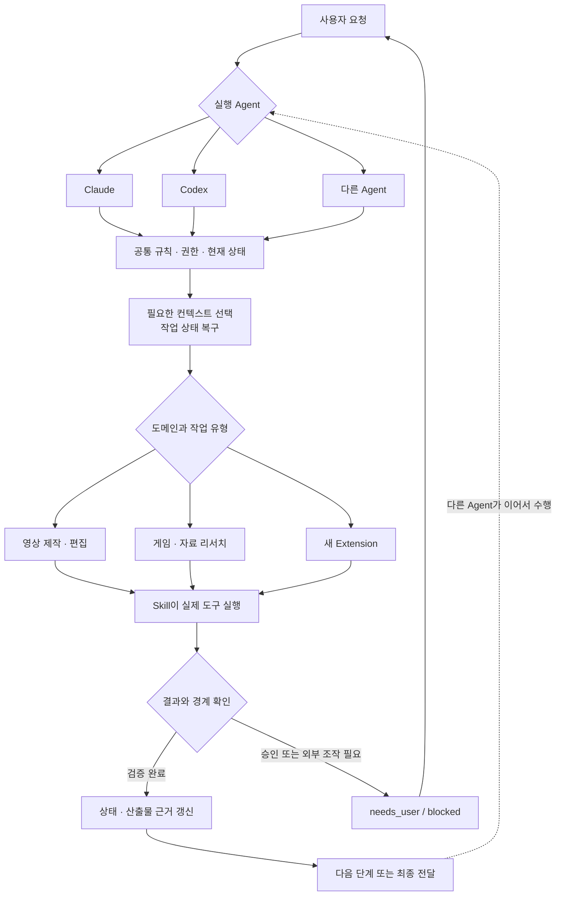

# Agent 기반 크리에이터 워크플로 시스템

이 프로젝트는 영상 제작을 자동화하기 위한 프로젝트가 아닙니다.
영상 제작 워크플로와 그 과정에서 축적되는 데이터는 AI Agent의 자율성과 협업 방식을 실제 업무에서 검증하기 위한 테스트 영역입니다.

또한 이 프로젝트는 하나의 AI Agent에 종속된 자동화 프로젝트가 아닙니다.
실제로 현재 Claude와 Codex가 동일한 프로젝트에서 함께 작업하고 있습니다.

이 프로젝트의 목적은 사람이 매번 모든 맥락을 다시 설명하지 않아도, **Claude와 Codex처럼 서로 다른 Agent가 동일한 규칙·상태·지식·작업 근거를 공유하며 실제 업무를 이어서 수행할 수 있는 환경**을 만드는 것입니다. 어떤 Agent가 작업을 시작하거나 넘겨받더라도 사용자의 의도와 판단 기준이 유지되며, 최종 결정권과 민감 정보, 외부 행동의 권한은 사용자에게 남겨 둡니다.

핵심은 프로젝트 상태를 특정 Agent의 대화 기억에 가두지 않는 것입니다. 이를 위해 필요한 정보만 선택하고, 적절한 도구를 실행하고, 결과를 검증하고, 다른 Agent도 중단 지점부터 재개할 수 있는 공통 구조를 구현했습니다. 현재는 YouTube·영상 제작과 게임 리서치가 대표적인 확장 영역입니다.

## 이 구조에서 중요하게 보는 것

- 에이전트의 자율성은 사용자가 승인한 목표와 경계 안에서만 확장합니다.
- 특정 Agent 제품에 종속하지 않으며 Claude와 Codex가 같은 프로젝트 상태와 작업 기준을 공유합니다.
- 현재 상태와 근거는 대화 기억이 아니라 재구성 가능한 파일이 소유합니다.
- 외부 서비스 조작, 게시, 일정 등록과 같은 효과는 로컬 작업 성공과 구분합니다.
- 원본과 결과물은 `inputs/`, `outputs/`에 격리하고 Git 추적에서 제외합니다.
- 자동 검증이 판단할 수 없는 창작 품질과 사용자 선택은 명시적인 gate로 남깁니다.
- 새 도메인은 Extension으로 추가하고 공통성이 검증된 기반만 Core에 유지합니다.

## 프로젝트가 해결하려는 문제

일반적인 에이전트 작업은 대화가 끝나면 진행 맥락을 잃기 쉽고, 여러 도구를 연결할수록 다음 문제가 커집니다.

- 어떤 작업이 끝났고 무엇을 이어서 해야 하는지 불명확해집니다.
- 대화 기억에 의존하면 승인 범위와 작업 근거를 재현하기 어렵습니다.
- Agent마다 별도의 기억과 규칙을 사용하면 작업을 넘길 때 사용자의 의도와 판단 기준이 달라질 수 있습니다.
- 브라우저, 로컬 도구, 생성 결과가 섞이면 실패 지점과 책임 경계가 흐려집니다.
- 프로젝트마다 같은 상태 관리·검증·복구 구조를 다시 만들어야 합니다.
- 원본 미디어와 개인정보가 코드나 작업 기록에 섞일 위험이 있습니다.

이 저장소는 이를 해결하기 위해 **공통 Agent Core**, **도메인별 Extension**, **재사용 가능한 Skills**, **파일 기반 상태와 지식 계약**을 분리했습니다.

## 전체 작동 방식

1. Claude와 Codex는 각자의 진입 파일을 통해 같은 프로젝트 규칙으로 합류합니다.
2. `PROJECT_RULES.md`와 현재 상태 문서가 Agent 종류와 무관하게 권한, 보호 데이터, 작업 범위를 결정합니다.
3. Core가 현재 작업과 필요한 근거를 복구하고 실행 가능한 다음 행동을 좁힙니다.
4. Extension이 영상, 리서치 등 도메인별 의미와 완료 조건을 적용합니다.
5. Skill이 브라우저·미디어·생성 도구 같은 실제 capability를 실행합니다.
6. 결과가 계약을 만족할 때만 상태를 전이하고, 사용자 승인이나 외부 효과가 필요하면 명시적으로 멈춥니다.

## 현재 구현된 대표 워크플로

### 콘텐츠 제작

`리서치 → 영상 생성 → 자막 → 제목·썸네일 → 수동 업로드 패키지`

NotebookLM은 이 흐름의 리서치·영상 생성 단계에서만 사용됩니다. 전체 흐름은 영상별 작업 상태가 소유하며, 최종 결과는 사용자가 직접 업로드할 파일 패키지로 전달됩니다.

### 촬영 후 영상 편집

`원본 분석 → 방향 선택 → 상세 컷 설계 → 의미 검수 → timeline 검증 → Premiere XML`

기술적으로 열리는 XML만 만드는 것이 아니라 발화, 인과, 공간, 반복과 전환을 별도의 의미 gate로 확인하도록 설계되어 있습니다.

### 리서치와 일정 연결

`자료 수집 → 출처 교차 확인 → 후보 정리 → 사용자 승인 → 일정 등록`

게임 리서치처럼 조사 결과가 외부 서비스 변경으로 이어지는 작업은 조사와 실제 등록을 분리합니다.

## 구현 구조

### 1. Root — 프로젝트 진입과 권한

루트 문서는 모든 파일을 매번 읽지 않고도 현재 작업에 필요한 규칙만 찾도록 구성되어 있습니다.

| 파일 | 역할 |
|---|---|
| `AGENTS.md` | Codex와 호환 Agent가 공통 정책으로 진입하는 시작점 |
| `CLAUDE.md` | Claude가 같은 공통 정책으로 진입하는 시작점 |
| `PROJECT_RULES.md` | 모든 Agent가 공유하는 권한, 보호 데이터, 변경 범위와 조건부 규칙 |
| `SESSION_HANDOFF.md` | 현재 작업, 차단 상태, 첫 다음 행동의 단일 owner |
| `README.md` | 사람을 위한 프로젝트 개요 |

완료된 작업의 상세 과정은 현재 문서에 계속 쌓지 않고 Git 이력으로 보존합니다. 덕분에 새 세션이 읽어야 할 시작 문맥을 작게 유지할 수 있습니다.

### 2. Core — 도메인 중립 Agent 기반

`core/`는 YouTube, 게임, 영상 같은 특정 도메인을 알지 못합니다. 여러 작업에서 공통으로 필요한 기반만 소유합니다.

| 영역 | 구현 이유 |
|---|---|
| 기록과 이벤트 | 작업 결과를 대화가 아닌 재현 가능한 파일 기록으로 남깁니다. |
| 작업 상태 | 이벤트를 다시 재생해 현재 상태와 다음 행동을 복구합니다. |
| 지식 수명주기 | 사실·추론·절차·결정을 candidate와 current로 구분해 오래된 지식의 재사용을 막습니다. |
| 선택적 컨텍스트 | 전체 프로젝트를 다시 읽는 대신 현재 작업에 필요한 근거만 문자 예산 안에서 구성합니다. |
| 문서와 artifact 관계 | 사람이 관리하는 Markdown을 정본으로 두고 필요한 구조화 파일을 결정론적으로 파생합니다. |
| 유지보수 경계 | 중복 owner, 끊어진 링크, 보호 경로 접근, 구조 drift를 발견하면 자동으로 추정하지 않고 중단합니다. |
| 실패 지식 | 반복 가치가 있는 해결된 실패만 원인별로 보존해 다음 작업에 재사용합니다. |

Core를 변경 보호 영역으로 둔 이유는 도메인 기능을 추가할 때 공통 기반의 안전성과 계약이 함께 흔들리지 않게 하기 위해서입니다.

### 3. Extension — 실제 작업 기능

`extension/`은 Core의 공개 계약을 사용해 실제 도메인 기능을 구현합니다. 새로운 작업 종류는 Core에 넣지 않고 이 영역에 추가합니다.

현재 포함된 주요 기능은 다음과 같습니다.

- 영상 제작 작업의 단계 선택·중단·재개를 담당하는 상태 엔진
- 촬영 전 근거를 선택해 구성하는 YouTube evidence pack
- SRT 검증·정리, 컷 timeline 진단, Premiere XML 생성
- 영상별 리서치·영상·자막·제목·썸네일·업로드 패키지 연결
- 여러 도메인이 같은 Core 계약을 사용할 수 있는지 확인하는 conformance adapter
- 반복 작업의 시간·개입·실패를 집계하는 학습 지표
- 한국 게임 출시·업데이트 정보를 조사하고 승인 후 일정으로 연결하는 보조 워크플로

### 4. Skills — 도구 사용 절차

`.agents/skills/`는 “어떤 도구를 어떤 순서와 조건으로 사용할 것인가”를 캡슐화합니다. 상태 엔진은 다음 단계를 선택하고, Skill은 실제 실행 방법을 담당합니다.

이 분리 덕분에 브라우저 연결 방식이나 전사 도구가 달라져도 프로젝트 전체의 상태 구조를 다시 만들 필요가 없습니다.

## 사용 중인 도구와 선택 이유

| 도구·형식 | 사용하는 이유 |
|---|---|
| Claude + Codex | 서로 다른 Agent의 강점과 도구를 활용하면서도 같은 규칙·상태·근거를 바탕으로 작업을 주고받기 위해 사용합니다. |
| Agent Skills | 복잡한 작업 절차를 재사용 가능한 capability 단위로 분리하고 요청에 맞춰 선택하기 위해 사용합니다. |
| Git | 완료 이력과 복구 지점을 코드·문서와 함께 보존하고 저장소 안의 중복 백업을 줄입니다. |
| Markdown + Obsidian | 규칙과 계약을 사람이 직접 검토할 수 있게 유지하면서 링크 기반으로 책임 관계를 탐색합니다. |
| JSON / JSONL / JSON Schema | 상태 snapshot, 추가 전용 이벤트, 도메인 payload의 구조를 명시적으로 구분합니다. |
| SHA-256 | 기록과 산출물이 재개 시점에도 같은 내용인지 확인합니다. |
| Chrome + ChatGPT Extension | 사용자가 이미 로그인한 브라우저 세션이 필요한 작업을 별도 profile 경계 안에서 실행합니다. |
| NotebookLM | 현재 영상 제작 확장에서 출처 기반 리서치와 동영상 오버뷰 생성을 담당합니다. 프로젝트 전체 기반이 아니라 교체 가능한 외부 capability입니다. |
| FFmpeg / FFprobe | 영상 길이·코덱·스트림을 확인하고 미디어 변환과 로컬 검증을 수행합니다. |
| faster-whisper / whisper.cpp | 영상 음성을 SRT로 변환합니다. 전자는 기본 전사 경로, 후자는 선택 가능한 오프라인 backend입니다. |
| 이미지 생성 + 선택적 로컬 합성 | 제목·썸네일 단계에서 승인 계약에 맞는 완성 시각을 제작합니다. |
| Premiere XML | 편집 결정을 특정 편집 앱 내부 상태에 가두지 않고 검토 가능한 timeline으로 전달합니다. |
| Google Calendar | 게임 출시·업데이트 리서치 결과를 사용자 승인 후 실제 일정으로 연결합니다. |

## 문서 탐색 경로

- 프로젝트의 현재 상태: `SESSION_HANDOFF.md`
- 공통 기반의 책임: `core/README.md`
- 실제 도메인 구조: `extension/README.md`
- 정보와 문서의 소유 관계: `core/docs/INFORMATION_ARCHITECTURE.md`
- 영상 제작 조정 절차: `.agents/skills/coordinate-video-production/SKILL.md`
- 촬영 후 편집 계약: `extension/docs/domain/youtube/VIDEO_EDITING_WORKFLOW_CONTRACT.md`

이 README는 사람을 위한 개요입니다. Codex와 호환 Agent는 `AGENTS.md`, Claude는 `CLAUDE.md`에서 시작하지만 모두 `PROJECT_RULES.md`와 같은 현재 상태 문서로 합류합니다. 이후에는 Agent 종류와 무관하게 현재 작업에 필요한 규칙과 계약만 추가로 읽습니다.
