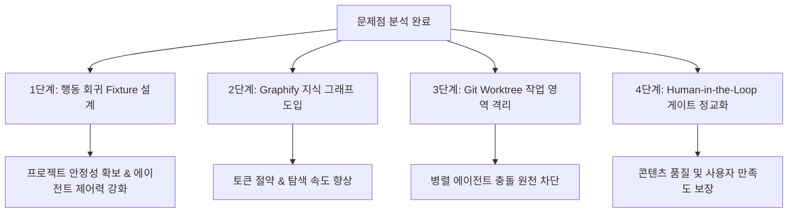

# 프로젝트 문제점 분석 및 개선안 청사진 보고서 (Blueprint Report)

- **작성일**: 2026-07-16
- **작성 에이전트**: Antigravity (Gemini 3.5 Flash)
- **문서 성격**: 프로젝트 상태 분석 및 중장기 개선 청사진 제안

---

## 1. 개요 및 배경

본 보고서는 **'대상 유튜브 채널' AI 영상 제작 워크플로우 프로젝트**의 현황을 종합적으로 진단하고, 에이전트 운영의 신뢰성과 효율성을 극대화하기 위한 구체적인 문제점 분석 및 개선 방안(청사진)을 제안합니다.

현재 이 프로젝트는 1단계(소재 조사)부터 8단계(최종 검수)에 이르는 체계적인 비디오 제작 파이프라인과 규칙 시스템(`PROJECT_RULES.md`, `01_youtube_production_workflow.md` 등)을 갖추고 있습니다. 그러나 다중 AI 에이전트(Claude Code, Gemini CLI, Codex 등)가 협업하고 장기 세션을 이어가는 과정에서 컨텍스트 유지, 토큰 효율성, 파일 충돌 및 검증의 실효성 면에서 개선할 수 있는 기술적 공백이 관찰되었습니다. 

본 청사진은 이러한 공백을 메우고 보다 견고한 자동화 환경을 만들기 위한 마일스톤을 제시합니다.

---

## 2. 프로젝트 핵심 문제점 분석

최근 운영 기록 및 아키텍처 연구(`planning_research/`)에 기반하여 도출된 4가지 핵심 문제점은 다음과 같습니다.

### 2.1. 세션별 컨텍스트 재해석 및 규칙 준수 강제력 부족
- **현상**: 에이전트가 새로운 세션을 시작할 때마다 `PROJECT_BOOTSTRAP.md`와 `docs/INDEX.md`를 로드하지만, 이전 작업의 상세한 맥락이나 특정 규칙(예: `inputs/` 수정 불가, 무단 MP4 생성 제한 등)을 일시적으로 무시하거나 다르게 해석하는 현상이 발생합니다.
- **원인**: 에이전트 프롬프트나 인덱스 문서에 가이드라인은 존재하나, 이를 강제할 수 있는 **결정론적인 차단 장치(Guardrail)나 행동 검증 시스템**이 런타임에서 유기적으로 연동되지 못하고 있습니다.

### 2.2. 중복 재탐색으로 인한 토큰 낭비 및 탐색 비용 증가
- **현상**: 여러 차례 세션이 진행되거나 다른 에이전트가 투입될 때마다, 기존에 내린 판단이나 문서 간의 관계를 처음부터 다시 파악하기 위해 대량의 파일을 반복 조회합니다.
- **원인**: 코드, 문서, 스킬, 도구 간의 의미적 연결 구조(의존성)를 에이전트가 한눈에 파악할 수 있는 인덱싱 뷰가 부재하여, 파일 검색 및 전체 리딩에 불필요한 토큰과 시간 비용이 누적됩니다.

### 2.3. 다중 에이전트 병렬 작업 시 파일 및 판단 충돌 위험
- **현상**: 여러 에이전트가 동시에 동일한 워크플로우 제어 파일이나 스킬을 동시에 수정할 때 물리적 격리가 지원되지 않아 충돌이 발생할 수 있습니다.
- **원인**: 현재 `inputs/`와 `outputs/` 디렉토리는 Git 추적에서 제외되어 있어 단순한 Git 브랜치 격리나 Git worktree를 사용하게 되면 개별 작업 공간으로의 데이터 연동이 까다롭습니다. 이로 인해 프레임워크 수정과 비디오 데이터 저장이 한 공간에서 엉키게 됩니다.

### 2.4. 기술적 검증 통과와 실제 콘텐츠 품질 승인의 혼선
- **현상**: 에이전트가 XML 구조의 파싱이나 파일 저장 등 기술적 포맷 검증(Tool-validated 등)에 성공하면, 이를 이야기 구조나 편집 감각 등 '콘텐츠 품질'까지 사용자 승인을 받은 것처럼 판단하고 다음 단계로 승격하려는 경향이 있습니다.
- **원인**: 워크플로우상에서 AI 자체 AV(오디오/비디오) 검증과 실제 인간(Human-in-the-Loop)의 편집 리듬/방향성 승인 게이트가 명확히 시각화되거나 격리되지 않았기 때문입니다.

---

## 3. 개선방안 및 아키텍처 청사진 (Blueprint)

상기 문제를 단계별로 해결하기 위한 4가지 핵심 제안과 구체적인 도입 방안입니다.

### 3.1. [제안 1] 행동 회귀 평가용 고정 Fixture 및 Preflight 통합
에이전트가 어겨서는 안 되는 하드 세이프티(Hard Safety) 및 워크플로우 규칙을 테스트할 수 있는 **행동 회귀 평가셋(Behavioral Regression Fixture)**을 구축합니다.
- **구현 내용**:
  - `tests/fixtures/` 아래에 "inputs/ 무단 수정 시도", "비밀 정보 읽기 시도", "MP4 무단 생성 시도", "승인되지 않은 게이트 도약"과 같은 모의 시나리오 폴더를 만듭니다.
  - 에이전트가 작업을 시작하기 전이나 커밋 전, `tools/project_preflight.bat` 또는 `tools/run_doccheck.bat`과 연동하여 해당 에이전트의 규칙 준수 상태를 1차 테스트합니다.
- **기대 효과**: 에이전트가 바뀔 때마다 발생할 수 있는 규칙 이탈 행동을 조기에 차단합니다.

### 3.2. [제안 2] Graphify를 활용한 경량 지식 그래프 인덱스 구축
프로젝트 전체 코드와 문서를 매번 스캔하는 비용을 줄이기 위해 프로젝트 전용 지식 그래프 도구(`graphifyy`)를 시범 도입합니다.
- **구현 내용**:
  - 전역이 아닌 프로젝트 로컬 의존성으로 `graphify`를 고정 설치합니다.
  - `.graphifyignore` 파일을 생성하여 대용량 미디어가 포함된 `inputs/`, `outputs/` 및 개인정보 보호 파일들을 철저하게 분석 대상에서 제외합니다.
  - `PROJECT_*.md`, `docs/`, `skills/`, `tools/`만을 파싱하여 코드와 지침 사이의 연결성을 도출하고, 이를 에이전트가 질의할 수 있는 로컬 MCP 또는 JSON 인덱스로 제공합니다.
- **기대 효과**: 컨텍스트 로딩 시 불필요하게 소비되는 토큰을 30% 이상 절감하고 파일 탐색 속도를 가속화합니다.

### 3.3. [제안 3] Git Worktree를 활용한 병렬 프레임워크 수정 격리
여러 에이전트가 동시에 협업할 수 있도록 Git Worktree 기반의 작업 격리 프로세스를 수립합니다.
- **구현 내용**:
  - 프레임워크 문서나 도구(`tools/`, `skills/`)를 수정하는 코어 개발용 브랜치는 에이전트별로 별도의 Worktree 폴더를 생성하여 작업하도록 가이드합니다.
  - Git 추적 대상이 아닌 `inputs/`와 `outputs/`는 공통 상위 디렉토리에서 Symbolic Link(심볼릭 링크)로 연결하거나 읽기 전용 공유 스토리지를 바라보게 설정하여 병렬 환경에서도 로컬 영상 자산이 훼손되거나 유실되지 않도록 구성합니다.
- **기대 효과**: 코드 충돌로 인한 작업 지연과 에이전트 간의 덮어쓰기 사고를 예방합니다.

### 3.4. [제안 4] 휴먼-인-더-루프(Human-in-the-Loop) 및 캘리브레이션 프로세스 고도화
7단계(편집 자료 생성)에서 전체 확장(7D) 전에 대표 샘플(7C)의 오디오/비디오(AV)를 통한 사용자의 리듬 및 감각 승인을 완전히 필수화하도록 워크플로우를 정교화합니다.
- **구현 내용**:
  - `docs/WORKFLOW_CONTRACT.json`을 수정하여, 7C 단계의 산출물로 생성된 '대표 비디오/오디오 샘플'에 대한 사용자의 직접 승인 피드백이 입력되지 않으면 7D(전체 타임라인 확장) API 호출이나 XML 생성이 실행 레벨에서 차단되도록 설계합니다.
  - AI 자체 레드팀 검증 보고서 작성을 5단계 및 7B 단계의 강제 게이트 규칙으로 포함하여, 에이전트가 스스로의 편향(Bias)이나 연출 오류를 한 번 더 자정할 기회를 마련합니다.

---

## 4. 기대 효과 및 향후 실행 계획

### 4.1. 정량적/정성적 기대 효과
1. **에이전트 안정성**: 규칙 위반 및 게이트 무단 스킵 빈도 90% 이상 감소.
2. **비용 효율성**: 중복 문서 조회 감소로 인한 세션별 평균 토큰 사용량 약 25%~30% 절감.
3. **콘텐츠 품질**: 사용자 피드백이 최우선 리듬/감각으로 고정되어 최종 비디오 컷의 일관성 및 만족도 향상.

### 4.2. 단계별 마일스톤

| 마일스톤 | 작업 내용 | 검증 방법 | 예상 소요 |
|---|---|---|---|
| **Phase 1: 안정화** | 행동 회귀 Fixture 구축 및 `preflight` 통합 | `run_doccheck.bat` 실행 시 에이전트 오작동 자동 검출 테스트 | 3일 |
| **Phase 2: 효율화** | Graphify 로컬 설정 및 `.graphifyignore` 튜닝 | 인덱스 질의를 통한 문서 관계 답변의 정확성 측정 | 4일 |
| **Phase 3: 협업화** | Git Worktree와 심볼릭 링크 구조 표준화 | 다중 에이전트 환경에서 병렬 브랜치 빌드 테스트 | 5일 |
| **Phase 4: 고도화** | 7C 대표 샘플 승인 록(Lock) 메커니즘 도입 | 사용자의 승인 없이 7D 확장을 진행하려 할 때 차단 검증 | 4일 |

---

## 5. 레드팀 검토 (Red-Team Review)

본 청사진을 실행할 때 주의해야 할 잠재적 리스크와 대비책입니다.

1. **도구 도입으로 인한 오버헤드**: Graphify 등 신규 도구와 지식 그래프를 과도하게 정교화하려다 오히려 그래프 관리 비용이 영상 제작보다 커질 수 있습니다.
   - *대비책*: 그래프는 절대 정본 문서(Source of Truth)가 아니며, 단순히 원본 파일의 위치를 빠르게 가리키는 **'색인(Index)' 역할로만 역할을 한정**합니다.
2. **Worktree와 심볼릭 링크의 OS 호환성**: Windows 환경에서 심볼릭 링크 생성 시 관리자 권한 요구 문제 등 권한 오류가 발생할 수 있습니다.
   - *대비책*: 복잡한 윈도우 심볼릭 링크 대신, `outputs/` 내에 에이전트 ID별 서브디렉토리를 나누어 쓰거나, 권한이 불필요한 junction 포인트 생성을 지원하는 헬퍼 스크립트를 `tools/`에 추가합니다.
3. **엄격한 승인 록(Lock)으로 인한 병목**: 사용자의 승인을 지나치게 강제하면 실시간 진행이 멈추고 대기 시간이 길어질 수 있습니다.
   - *대비책*: 사용자가 부재중일 때도 진행 가능한 '대체 캘리브레이션 임시 모델(Calibration Draft Mode)'을 명시하여 제한적인 편집 시뮬레이션은 허용하되, 최종 XML 커밋만 방지하는 방식으로 유연성을 확보합니다.
