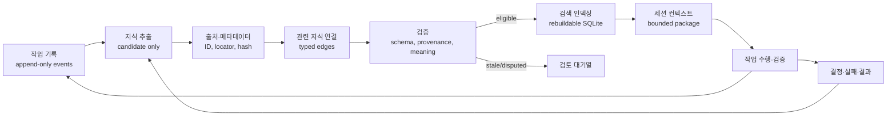

# 프로젝트 기반 및 지식 시스템 설계 보고서

- 작성일: 2026-07-20
- 상태: 명령 2 설계 결과 / 2026-07-20 사용자 승인
- 목적: 빈 활성 프로젝트에 다시 만들 기본 구조와, 작업 경험을 출처가 추적되는 지식으로 축적·검색·갱신하는 로컬 지식 시스템을 설계한다.
- 사용 시점: 기반 문서나 지식 시스템을 구현·검토하거나 설계 결정의 근거를 확인할 때 사용한다.
- 작성·수정 주체: 에이전트가 내부 근거와 최신 공식 자료로 작성·정정하고, 설계의 채택과 변경은 사용자가 승인한다.
- 언어: 한국어.
- 저장 위치와 연결 관계: `docs/reports/2026-07-20_프로젝트_기반_및_지식_시스템_설계.md`. [프로젝트 소개](../../README.md), [문서 지도](../agent/DOCUMENT_MAP.md), [선행 분석 보고서](2026-07-20_기존_프로젝트_분석.md)와 연결한다.
- 입력: [기존 프로젝트 분석 보고서](2026-07-20_기존_프로젝트_분석.md), `backup/`의 확인된 역사 자료, 2026-07-20에 확인한 공식 문서.
- 범위: 구조, 규칙, 기록·지식 데이터 모델, 관계, 검증, 검색 인덱스, 컨텍스트 조립, 검토·갱신, 단계별 구축안.
- 비범위: 파일·코드·데이터베이스 생성, 패키지 설치, 인덱스 구축, `backup/` 변경, 기존 기능 이식.
- 실행 권한: 사용자가 명령 3 기반 구축의 근거로 승인했다. 명령 4 지식·RAG 구현은 명령 3 결과 보고 후 별도 승인을 받아야 한다.
- 현재 권위·보존 상태: D-01~D-11의 승인 근거인 `retained-evidence`다. 후속 구현 근거로 단독 사용하지 않으며, 보정 중인 현재 제안은 [R-1.1 설계 보정](2026-07-20_R-1.1_지식_시스템_설계_보정.md)에서만 검토한다.

## 1. 판정 표기

확인된 사실과 설계 판단을 다음처럼 구분한다.

| 표기 | 의미 |
|---|---|
| `F` | 프로젝트 파일 또는 공식 문서에서 직접 확인한 사실 |
| `H` | 기존 프로젝트 보고서에 기록됐지만 이번 단계에서 재실행하지 않은 역사적 결과 |
| `I` | 확인된 사실을 결합해 도출한 추론 |
| `D` | 이번 설계에서 승인을 요청하는 결정 |
| `O` | 최소안 이후에만 검토할 확장 선택지 |

기술 제품의 기능 설명은 공식 문서에 연결했다. 성능 임계값과 도입 순서는 이 프로젝트를 위한 `D` 또는 `O`이며 외부 자료가 보장하는 수치가 아니다.

## 2. 결론

`D` 권장안은 **파일 정본 + 재생성 가능한 로컬 검색 인덱스**다.

1. Markdown과 JSONL이 기록·지식·결정·관계의 정본이다.
2. JSON Schema Draft 2020-12로 기계 판독 레코드를 검증한다.
3. SQLite는 정본이 아니라 삭제 후 다시 만들 수 있는 인덱스다.
4. 첫 검색기는 SQLite FTS5의 전문 검색, 메타데이터 필터, 1-hop 관계 확장을 결합한다.
5. Obsidian은 사람이 탐색하는 선택형 UI로만 사용한다.
6. 벡터 검색과 전용 그래프 DB는 초기 구축에서 제외한다. 고정 평가 질의로 실제 결함과 개선을 증명한 뒤 확장한다.
7. 세션에는 저장소 전체가 아니라, 작업 요청·항상 적용 규칙·직접 지정 문서·검증된 검색 결과만 포함한 재현 가능한 컨텍스트 패키지를 제공한다.
8. 작업 결과는 다시 원본 작업 기록에 추가되고, 검토 가능한 지식 후보·결정·실패 사례로 분리돼 같은 흐름에 들어간다.

이 안은 기존 프로젝트가 겪은 두 실패를 동시에 피한다.

- 단순 문서 필터를 RAG라고 부르지 않는다.
- 실제 사용과 평가 전에 상태 플랫폼, 다중 서비스, 벡터 DB, 그래프 DB를 먼저 만들지 않는다.

## 3. 설계 근거

### 3.1 내부 근거

| 근거 | 확인 내용 | 설계 영향 |
|---|---|---|
| [기존 프로젝트 분석](2026-07-20_기존_프로젝트_분석.md) | 활성 루트는 비어 있고, 기존 Obsidian/Base는 RAG가 아니며, 작업 기록·검증 지식·출처·갱신·컨텍스트 패키지가 누락됨 | 새 정본과 폐쇄형 데이터 흐름을 처음부터 분리 설계 |
| [`origin/PROJECT_RULES.md`](../../backup/origin/PROJECT_RULES.md) | 보호 경로, 사용자 데이터, 검증 수준, 사용자 창작 권한에 관한 규칙이 존재 | 전역 규칙과 검색 경계를 복원하되 세부 절차와 분리 |
| [`origin/01_youtube_production_workflow.md`](../../backup/origin/01_youtube_production_workflow.md) | 영상 제작 순서와 단계별 산출물 계약이 존재 | 도메인 워크플로는 나중에 선택 이식하고 지식 플랫폼과 결합하지 않음 |
| [`refactorying_snapshot_1/SESSION_HANDOFF.md`](../../backup/refactorying_snapshot_1/SESSION_HANDOFF.md) | 테스트가 많아져도 실제 사용자 작업과 생산성 검증이 없으면 성공이 아님 | 구현 단계에 실제 검색·인수인계 사용 시나리오 포함 |
| [`refactorying_snapshot_2/PROJECT_RULES.md`](../../backup/refactorying_snapshot_2/PROJECT_RULES.md) | 파일 기반 상태, 직접 라우팅, 원자 문서 방향 | 한 권위·한 상태·직접 경로 원칙 유지 |
| [`refactorying_snapshot_2/docs/agent/navigation/DOCUMENT_REGISTRY.md`](../../backup/refactorying_snapshot_2/docs/agent/navigation/DOCUMENT_REGISTRY.md) | 문서 역할과 등록·배치 규칙 시도 | 문서별 목적·독자·언어·위치를 명시하되 별도 거대 레지스트리는 피함 |

`F` 위 파일은 모두 역사 자료다. 새 시스템은 `backup/`에 런타임 의존하지 않으며, 승인 후 필요한 지식만 출처와 함께 새 정본으로 옮긴다.

### 3.2 외부 공식 근거

| ID | 공식 자료에서 확인한 사실 | 설계 영향 |
|---|---|---|
| `O-OBS-1` | [Obsidian 데이터 저장](https://help.obsidian.md/Files+and+folders/How+Obsidian+stores+data)은 노트를 로컬 Vault의 일반 Markdown 파일로 저장하고 `.obsidian`에 설정을 둔다고 설명한다. | Obsidian을 사용해도 Markdown 정본을 유지할 수 있음 |
| `O-OBS-2` | [Obsidian Properties](https://help.obsidian.md/Editing+and+formatting/Properties)는 속성을 YAML에 저장하며, 중첩 속성과 앱 내 일괄 편집에 제한이 있다고 설명한다. | 핵심 검증 스키마를 Properties에만 의존하지 않음 |
| `O-OBS-3` | [Obsidian Bases](https://help.obsidian.md/Plugins/Bases)는 파일과 Properties에 대한 데이터베이스형 보기를 제공하며 데이터는 로컬 Markdown에 남는다. | Base는 검색 정본이나 RAG가 아니라 선택형 보기 |
| `O-OBS-4` | [Obsidian CLI](https://help.obsidian.md/cli)는 앱이 실행 중이어야 하며 검색·속성·Base 명령을 제공한다. | 무인 핵심 경로가 CLI나 GUI 실행에 의존하지 않음 |
| `O-SQL-1` | [SQLite FTS5](https://www.sqlite.org/fts5.html)는 `MATCH`, `bm25`, 구문·접두어·NEAR·불리언 검색과 `unicode61`, `trigram` 등 토크나이저를 제공한다. | 최소 전문 검색과 한국어 토크나이저 평가에 사용 |
| `O-SQL-2` | [SQLite 트랜잭션](https://www.sqlite.org/lang_transaction.html)은 여러 읽기 트랜잭션과 한 번에 하나의 쓰기 트랜잭션을 허용한다. | 단일 로컬 작성자·원자적 인덱스 교체를 기본으로 함 |
| `O-SQL-3` | [SQLite WAL](https://www.sqlite.org/wal.html)은 동시성 이점이 있지만 같은 호스트 조건, 보조 파일, 체크포인트 관리가 필요하다. | 측정 전에는 기본 저널 모드를 유지하고 WAL을 기본값으로 삼지 않음 |
| `O-SQL-4` | [SQLite JSON1](https://www.sqlite.org/json1.html)은 JSON 함수를 기본 내장하지만 JSON을 일반 텍스트로 저장한다. | 원본 JSONL은 파일에 두고 인덱스 메타데이터 질의에 JSON 함수를 선택 사용 |
| `O-SCHEMA-1` | [JSON Schema 명세](https://json-schema.org/specification)는 현재 일반 목적 버전을 Draft 2020-12로 안내하며 Core와 Validation을 분리한다. | 레코드 계약을 명시적 버전의 JSON Schema로 고정 |
| `O-PROV-1` | [W3C PROV-O](https://www.w3.org/TR/prov-o/)는 출처를 Entity·Activity·Agent와 생성 관계에서 시작해 필요한 만큼 확장할 수 있게 한다. | 전체 온톨로지를 도입하지 않고 출처·행위·작성자 최소 모델만 참고 |
| `O-RAG-1` | [RAG 원 논문](https://arxiv.org/abs/2005.11401)은 모델 내부 기억과 별개인 비모수 메모리 및 검색을 결합하고, 출처와 지식 갱신 문제를 다룬다. | LLM 기억과 독립적인 외부 저장·검색·출처 반환을 필수로 함 |
| `O-VEC-1` | [Sentence Transformers semantic search](https://www.sbert.net/examples/sentence_transformer/applications/semantic-search/README.html)는 문서와 질의를 임베딩해 유사도를 계산하며 질의·문서 인코딩 구분을 설명한다. | 벡터 검색은 모델·인코딩 방식까지 버전 고정해야 함 |
| `O-VEC-2` | [Sentence Transformers 다국어 모델](https://www.sbert.net/docs/sentence_transformer/pretrained_models.html)은 한국어를 포함한 다국어 모델 선택지를 제공한다. | 확장 시 한국어 평가셋으로 모델을 선택할 수 있음 |
| `O-VEC-3` | [Ollama Embeddings](https://docs.ollama.com/capabilities/embeddings)은 로컬 API로 임베딩을 생성하며 색인과 질의에 같은 모델을 쓰도록 안내한다. | Ollama는 선택 가능한 로컬 임베딩 실행기이나 상시 프로세스 의존성이 생김 |
| `O-VEC-4` | [LanceDB SDK](https://lancedb.github.io/lancedb/)와 [로컬 연결 API](https://lancedb.github.io/lancedb/js/functions/connect/)는 로컬 경로에 연결하는 임베디드 벡터 저장 방식을 제공한다. | 서비스 없는 벡터 확장 후보 |
| `O-VEC-5` | [Qdrant Quickstart](https://qdrant.tech/documentation/quick-start/)는 로컬 서버 실행을 지원하지만 기본 로컬 시작은 인증·암호화가 없고 Windows 저장소 주의점이 있다. | 풍부한 벡터 기능이 필요할 때만 격리된 로컬 확장 후보 |
| `O-VEC-6` | [sqlite-vec 소개](https://alexgarcia.xyz/sqlite-vec/introduction.html)는 SQLite 벡터 확장을 제공하지만 현재 문서가 pre-v1 alpha임을 명시한다. | 최소안의 기본 의존성에서 제외 |
| `O-GRAPH-1` | [Neo4j 그래프 개념](https://neo4j.com/docs/getting-started/appendix/graphdb-concepts/)은 노드, 속성, 타입 있는 방향 관계의 property graph를 설명한다. | 같은 개념을 파일·SQLite의 작은 관계 테이블로 먼저 구현 |
| `O-GRAPH-2` | [Neo4j 데이터 모델링 지침](https://neo4j.com/docs/getting-started/data-modeling/tutorial-data-modeling/)은 먼저 사용 사례와 답해야 할 질문을 정의하도록 한다. | 실제 다중-hop 질의가 확인되기 전 전용 그래프 DB를 도입하지 않음 |

## 4. 설계 원칙

### 4.1 정본과 파생물

`D` 정본은 사람이 읽고 Git diff로 검토할 수 있는 파일이다.

- 규칙·설명·지식·결정·사례: Markdown
- 순서가 있는 원본 이벤트·관계·갱신 이력: JSONL
- 구조 계약: JSON Schema
- SQLite, FTS, 벡터, Base 보기, 컨텍스트 패키지: 원본에서 다시 만들 수 있는 파생물

파생물이 손상되거나 삭제돼도 지식이 사라지지 않아야 한다. 파생물에서만 존재하는 편집은 금지한다.

### 4.2 하나의 책임, 하나의 권위

- `PROJECT_RULES.md`는 항상 적용되는 공통 규칙만 가진다.
- 작업 절차는 워크플로 문서가 가진다.
- 기술 구조는 설계 문서가 가진다.
- 현재 중단점은 `SESSION_HANDOFF.md` 한 파일만 가진다.
- 개별 결정은 결정 레코드가 가진다.
- 검증된 주장과 그 근거는 지식 레코드가 가진다.
- 검색 점수나 컨텍스트 패키지는 권위가 아니다.

동일 내용을 여러 문서에 복사하지 않고 ID와 링크로 연결한다.

### 4.3 사실·추론·결정 분리

- 사실은 확인 가능한 출처와 위치를 요구한다.
- 추론은 사용한 사실 ID와 추론 근거를 요구한다.
- 결정은 선택지, 채택 이유, 승인 주체, 적용 범위, 대체 관계를 요구한다.
- 신뢰도가 높아도 추론이 사실로 승격되지는 않는다.
- 검색 점수가 높아도 초안이 검증 지식으로 승격되지는 않는다.

### 4.4 경계 우선

- `backup/`은 읽기 전용 역사 자료이며 기본 색인 대상이 아니다.
- 보호 대상 사용자 데이터는 전체 열거·전역 색인을 하지 않는다.
- 사용자가 정확히 지정한 작업 범위만 별도 task scope로 읽고 색인한다.
- 전역 지식으로 승격할 때는 입력 독립적이고 재사용 가능한 내용만 남기며 사용자 데이터·비밀·절대 경로를 제거한다.
- 검색된 일반 문서는 지시가 아니라 자료로 취급한다. 지시 권한은 명시된 규칙·승인 문서에만 있다.

### 4.5 작은 자동화와 명시적 실패

- 시작 시 모든 기능을 자동 활성화하지 않는다.
- 선택 도구가 없으면 조용히 우회하지 않고 기능 가용성과 제한을 보고한다.
- 긴 실행은 단계별 체크포인트와 재개 지점을 남긴다.
- 실패는 원본 작업 기록과 문제 사례에 반영한다.

## 5. 권장 프로젝트 구조

아래는 명령 3과 명령 4에서 만들 대상 구조다. 이번 단계에서는 만들지 않는다.

```text
/
├─ AGENTS.md
├─ PROJECT_RULES.md
├─ README.md
├─ SESSION_HANDOFF.md
├─ docs/
│  ├─ agent/
│  │  ├─ DOCUMENT_MAP.md
│  │  ├─ WORKFLOW.md
│  │  ├─ KNOWLEDGE_SYSTEM.md
│  │  ├─ CONTEXT_RETRIEVAL.md
│  │  └─ KNOWLEDGE_MAINTENANCE.md
│  ├─ user/
│  │  └─ GUIDE.md
│  └─ reports/
├─ records/
│  ├─ work/YYYY/MM/<session-id>.jsonl
│  └─ sessions/<session-id>.md
├─ knowledge/
│  ├─ items/<knowledge-id>.md
│  ├─ decisions/<decision-id>.md
│  ├─ cases/<case-id>.md
│  ├─ relations/relations.jsonl
│  ├─ history/events.jsonl
│  ├─ reviews/<review-id>.md
│  └─ schemas/*.schema.json
├─ context/
│  ├─ requests/<task-id>.json
│  └─ packages/<context-id>.json
├─ tools/
│  └─ knowledge/
├─ tests/
│  └─ knowledge/
└─ .project-index/
   ├─ knowledge.sqlite3
   └─ manifests/
```

### 5.1 추적 정책

| 구분 | Git 기본 정책 | 이유 |
|---|---|---|
| 규칙, 설명 문서, 스키마, 템플릿 | 추적 | 계약 변경을 검토 가능하게 유지 |
| 검증된 전역 지식, 결정, 일반화된 사례, 관계, 이력 | 비밀 검사 후 추적 | 세션과 기기에 독립적인 정본 유지 |
| 원본 작업 기록 | 로컬 정본, 내용 분류 후 선택 추적 | 크기·비밀·사용자 데이터가 섞일 수 있음 |
| 세션 요약 | 추적 | 다음 세션이 변경 이력을 복원 가능 |
| 작업별 사용자 데이터 지식 | 해당 작업의 보호 경로에 저장, 전역 Git·전역 인덱스 제외 | 데이터 경계 유지 |
| `.project-index/`, 컨텍스트 패키지 | Git 제외 | 재생성 가능한 파생물·환경별 결과 |

`I` 모든 원본 로그를 무조건 Git에 넣으면 “축적”은 되지만 비밀과 대용량 출력도 영구 보존될 위험이 있다. 따라서 원본성은 로컬 append-only 파일과 해시로 보장하고, Git 추적 여부는 데이터 등급에 따라 분리한다.

## 6. 문서 책임과 언어

명령 3에서 각 문서 머리말에 다음 다섯 속성을 명시한다: `Purpose`, `Use when`, `Owner`, `Language`, `Location/Links`.

| 문서 | 목적 | 사용 시점 | 작성·수정 주체 | 언어 | 위치와 연결 |
|---|---|---|---|---|---|
| `AGENTS.md` | 에이전트 시작 라우터 | 매 세션 시작 | 에이전트 제안, 사용자 승인 | 영어 | `PROJECT_RULES.md`, `DOCUMENT_MAP.md`, `SESSION_HANDOFF.md`로만 라우팅 |
| `PROJECT_RULES.md` | 항상 적용되는 공통 규칙 | 모든 작업 | 사용자 결정, 에이전트 유지보조 | 영어 | 세부 절차를 소유하지 않고 관련 문서 링크만 제공 |
| `README.md` | 프로젝트의 사용자용 입구 | 사람이 처음 볼 때 | 에이전트 작성, 사용자 승인 | 한국어 | 사용자 가이드·최신 보고서 링크 |
| `SESSION_HANDOFF.md` | 현재 상태와 다음 재개점 | 세션 시작·종료 | 작업 에이전트 | 영어 | 최근 세션 요약과 결정 ID를 링크; 과거 기록을 누적하지 않음 |
| `DOCUMENT_MAP.md` | 문서 역할·권위·관계 지도 | 문서 선택 시 | 에이전트 | 영어 | 모든 활성 문서의 목적과 권위만 짧게 등록 |
| `WORKFLOW.md` | 공통 작업 기록·검증·종료 절차 | 작업 수행 시 | 에이전트, 사용자 승인 | 영어 | 지식·검색 상세를 별도 문서로 연결 |
| `KNOWLEDGE_SYSTEM.md` | 데이터 모델·상태·관계 계약 | 기록·지식 생성 시 | 에이전트, 사용자 승인 | 영어 | 스키마와 유지보수 문서 연결 |
| `CONTEXT_RETRIEVAL.md` | 색인·검색·컨텍스트 조립 계약 | 세션 컨텍스트 생성 시 | 에이전트 | 영어 | 인덱스 manifest·평가셋 연결 |
| `KNOWLEDGE_MAINTENANCE.md` | 검토·폐기·충돌·재색인 절차 | 유지보수 시 | 에이전트, 중요 결정은 사용자 | 영어 | review·history·decision 레코드 연결 |
| `docs/user/GUIDE.md` | 사용자가 시스템을 이해하고 요청하는 방법 | 운영·승인 시 | 에이전트 | 한국어 | README와 보고서 연결 |
| `docs/reports/*.md` | 시점별 분석·설계·구축·검증 보고 | 단계 종료 시 | 에이전트 | 한국어 | 근거 파일과 결정 ID를 직접 링크 |

지식 레코드는 에이전트 작업용이므로 설명 필드는 영어를 기본으로 한다. 단, 사용자 발화·한국어 원문·인용은 번역해 정본을 바꾸지 않고 `language`와 함께 보존한다. 사용자에게 보여 주는 보고와 가이드는 한국어로 작성한다.

## 7. 데이터 모델

### 7.1 공통 식별자

`D` 사람이 보고 유형을 알 수 있고 파일명에 안전한 ID를 쓴다.

```text
work.20260720.<session>.<sequence>
session.20260720.<session>
know.<domain>.<slug>
dec.<domain>.<slug>
case.<domain>.<slug>
review.<date>.<sequence>
ctx.<date>.<task>.<sequence>
```

- ID는 생성 후 바꾸지 않는다.
- 제목 변경은 ID 변경 이유가 아니다.
- 중복 지식은 삭제·덮어쓰기보다 `supersedes`, `duplicates`, `merged_into` 관계로 처리한다.
- 파일명은 ID와 일치시켜 링크와 검증을 단순화한다.

### 7.2 공통 메타데이터

모든 지식·결정·사례 레코드는 최소한 다음 필드를 가진다.

| 필드 | 의미 |
|---|---|
| `schema_version` | 해석에 사용한 스키마 버전 |
| `id`, `kind`, `title` | 안정 ID, 레코드 종류, 표시 제목 |
| `language` | 본문 주 언어 |
| `created_at`, `updated_at` | ISO 8601 시각과 시간대 |
| `created_by`, `validated_by` | 작성·검증 주체 |
| `epistemic_type` | `fact`, `inference`, `procedure`, `constraint` 중 하나; 결정은 별도 kind |
| `status` | 종류별 수명주기 상태 |
| `confidence` | `low`, `medium`, `high` |
| `confidence_basis` | 신뢰도 판단 근거. 숫자만 저장하지 않음 |
| `source_refs` | 출처 ID 목록 |
| `related_ids` | 빠른 탐색용 관련 ID 목록. 정식 관계는 relation 레코드가 권위 |
| `valid_from`, `valid_until` | 알려진 적용 기간 |
| `checked_at`, `review_due_at` | 마지막 검토일과 다음 검토 기한 |
| `revision`, `history_ref` | 현재 개정과 append-only 변경 이력 위치 |
| `retrieval` | 기본 검색 포함 여부와 검색 등급 |

`confidence`는 출처 수를 기계적으로 세어 만들지 않는다. 공식 문서 직접 확인, 재현 테스트, 단일 역사 보고, 미검증 추론처럼 근거 유형을 `confidence_basis`에 적는다.

### 7.3 출처 참조

출처는 다음 정보를 가진다.

```json
{
  "source_id": "src.repo.knowledge-system.section-7",
  "type": "repo_file",
  "uri": "docs/agent/KNOWLEDGE_SYSTEM.md",
  "locator": "heading:Data model",
  "content_sha256": "...",
  "observed_at": "2026-07-20T00:00:00+09:00",
  "published_at": null,
  "authority": "project_contract"
}
```

규칙은 다음과 같다.

- 저장소 파일 경로는 상대 POSIX 경로를 쓴다. 개인 PC 절대 경로는 정본에 넣지 않는다.
- 위치는 `line`, `heading`, `json-pointer`, `event-range`, `url-fragment` 중 가능한 가장 안정적인 방법으로 기록한다.
- 파일 기반 출처는 내용 해시를 갖는다.
- 웹 출처는 URL, 문서 제목, 게시·확인일을 갖는다.
- 큰 원문이나 저작물 전체를 복사하지 않는다. 주장과 위치, 필요한 짧은 발췌만 기록한다.
- 출처가 바뀌면 기존 지식이 자동으로 참이 되거나 거짓이 되지 않고 `needs_review`가 된다.

### 7.4 원본 작업 기록

`records/work/...jsonl`은 append-only 이벤트 스트림이다. 한 줄이 한 이벤트이며 다음을 기록한다.

- 세션·작업 ID와 순번
- 사용자의 명시적 요청 또는 그 해시·안전한 요약
- 읽거나 변경한 허용 범위의 산출물 참조
- 수행한 명령·도구 작업의 재현에 필요한 안전한 요약
- 생성·변경 파일과 전후 해시
- 검증 명령, 종료 코드, 핵심 결과
- 실패, 중단점, 재시도, 해결 여부
- 지식 후보·결정·사례로 추출된 ID

다음은 기록하지 않는다.

- 모델의 숨은 내부 추론
- 비밀 값, 인증 정보, 환경 변수 원문
- 보호 경로의 전역 목록
- 필요 이상으로 큰 도구 출력이나 제3자 원문 전체

따라서 이 설계의 “원본 작업 기록”은 작업을 감사·재현하는 안전한 이벤트 원본이지, 화면과 내부 상태의 무제한 녹화가 아니다.

### 7.5 세션 요약과 인수인계

`records/sessions/<session-id>.md`는 종료된 세션의 불변 요약이다.

- 목표와 승인 범위
- 완료·미완료 항목
- 변경 파일과 지식·결정·사례 ID
- 실행한 검증과 결과
- 실패·알려진 위험
- 다음 작업과 정확한 재개점
- 대응하는 work event 범위

`SESSION_HANDOFF.md`는 이 요약들을 복사해 누적하지 않는다. 현재 재개에 필요한 항목과 가장 최근 요약 링크만 가진다.

### 7.6 검증 지식

`knowledge/items/<id>.md` 한 파일은 한 원자적 주장 또는 절차를 가진다.

- `Statement`: 무엇이 사실·추론·절차·제약인지
- `Scope`: 어느 프로젝트·버전·단계에 적용되는지
- `Evidence`: 출처 ID와 위치
- `Limitations`: 적용하지 못하는 조건
- `Validation`: 검증 방법과 결과
- `Relations`: 관련 지식·결정·사례 ID
- `Review`: 검토일·기한·갱신 조건

한 문서에 서로 독립적인 여러 주장을 넣지 않는다. 그래야 한 주장만 오래됐을 때 나머지 지식을 함께 폐기하지 않는다.

### 7.7 의사결정

`knowledge/decisions/<id>.md`는 다음을 가진다.

- 해결하려는 문제와 범위
- 고려한 선택지
- 채택한 결정과 이유
- 근거 지식·공식 출처
- 승인 주체와 승인 시각
- 결과와 후속 검증
- `proposed`, `accepted`, `superseded`, `revoked` 상태

사용자 승인 전 설계 판단은 `proposed`다. 승인된 결정만 규칙이나 구현 근거로 검색된다.

### 7.8 문제·실패·해결 사례

`knowledge/cases/<id>.md`는 다음을 가진다.

- 관찰된 증상
- 발생 조건과 영향
- 재현 절차 또는 증거
- 확인된 원인과 배제한 가설
- 해결·완화 방법
- 회귀 테스트 또는 재발 방지 규칙
- `observed`, `confirmed`, `resolved`, `recurring`, `retired` 상태

해결되지 않은 실패도 삭제하지 않고 `observed` 또는 `confirmed`로 남긴다. 다만 해결책처럼 검색되지 않게 한다.

### 7.9 관계 정보

`knowledge/relations/relations.jsonl`의 각 줄은 하나의 방향성 관계다.

```json
{
  "id": "rel.20260720.0001",
  "from_id": "know.search.fts5-korean",
  "type": "supported_by",
  "to_id": "src.official.sqlite.fts5",
  "evidence": ["src.official.sqlite.fts5#tokenizers"],
  "created_at": "2026-07-20T00:00:00+09:00",
  "status": "active"
}
```

허용 관계 유형은 초기에 작게 유지한다.

- 출처: `derived_from`, `supported_by`, `contradicted_by`
- 시간·대체: `supersedes`, `invalidates`, `merged_into`
- 구현·검증: `implements`, `validated_by`, `failed_in`
- 문제 해결: `caused_by`, `resolved_by`, `prevents`
- 구조: `part_of`, `depends_on`, `related_to`

관계의 존재가 진실을 뜻하지 않는다. 상태와 근거를 함께 검증한다. `supersedes` 순환, 자기 관계, 존재하지 않는 ID는 구조 검증에서 거부한다.

### 7.10 갱신 이력과 검토 기록

`knowledge/history/events.jsonl`은 지식 레코드의 모든 상태·내용 변경을 append-only로 기록한다.

- 대상 ID와 개정 번호
- 변경 전·후 해시
- 변경 유형
- 작성자와 시각
- 변경 이유와 근거
- 관련 review·decision ID

각 지식 파일의 `revision`과 `history_ref`가 이 이벤트로 연결되므로, 현재 파일만 보더라도 갱신 이력을 추적할 수 있다.

## 8. 데이터 흐름



### 8.1 단계별 계약

1. **작업 기록**: 작업 시작, 허용 범위, 수행, 변경, 검증, 실패를 시간순으로 추가한다.
2. **지식 추출**: 완료 이벤트에서 재사용 가능한 주장·결정·사례를 `candidate`로 만든다. LLM을 써도 후보 생성까지만 허용한다.
3. **출처·메타데이터 부여**: 모든 주장에 원본 event·파일·공식 URL과 위치·해시를 연결한다.
4. **관련 지식 연결**: 지원·충돌·대체·원인·해결 관계를 명시적으로 추가한다.
5. **검증**: 구조, 출처 접근성, 내용 일치, 적용 범위, 충돌, 필요 테스트를 확인한다.
6. **검색 인덱싱**: 검색 자격이 있는 현재 개정만 파생 인덱스에 넣는다.
7. **세션 컨텍스트 제공**: 작업 계약에 따라 직접 문서와 검색 결과를 예산 안에서 선택하고 출처와 선택 이유를 포함한다.
8. **작업 결과 반영**: 결과·검증·실패를 새 event로 남기고 관련 지식의 확인일, 상태, 관계를 갱신한다.

### 8.2 LLM 의존 경계

LLM 없이도 다음이 가능해야 한다.

- 스키마 검증
- 출처 파일과 위치 확인
- 해시 비교와 오래된 항목 탐지
- SQLite 인덱스 전체 재구축
- exact·metadata·FTS 검색
- 관계 1-hop 확장
- 컨텍스트 패키지 JSON 생성
- 선택된 항목에서 실제 출처까지 추적

LLM은 후보 추출, 질의 확장, 요약에 선택적으로 쓸 수 있다. LLM 출력은 자동으로 검증 지식이나 승인 결정이 되지 않는다.

## 9. 검증과 수명주기

### 9.1 종류별 상태

| 종류 | 상태 흐름 | 기본 검색 자격 |
|---|---|---|
| 지식 | `candidate → reviewed → verified → needs_review → superseded/rejected` | `verified`만 기본 포함 |
| 결정 | `proposed → accepted → superseded/revoked` | `accepted`만 지시 근거로 포함 |
| 사례 | `observed → confirmed → resolved/recurring → retired` | 증상 검색은 confirmed 이상, 해결책 검색은 resolved만 |
| 출처 | `active → changed/unavailable → archived` | active, 또는 역사 질문에서 archived |
| 관계 | `candidate → active → invalidated` | active만 확장 |

탐색 작업에서는 사용자가 요청한 경우에 한해 candidate·disputed 항목을 별도 구역에 표시할 수 있다. 검증 결과와 섞지 않는다.

### 9.2 검증 게이트

| 게이트 | 확인 내용 | 실패 처리 |
|---|---|---|
| G1 구조 | 스키마, ID, 필수 필드, 시간, 열거형 | 저장·색인 거부 |
| G2 출처 | URI·locator 존재, 해시·URL·event 연결 | `candidate` 유지 또는 `needs_review` |
| G3 의미 | 주장이 출처를 과장하지 않는지, 사실·추론 구분, 적용 범위 | 수정 또는 `rejected` |
| G4 충돌·신선도 | 모순, supersedes, checked/review_due, 권위 우선순위 | 충돌 표시·검토 대기 |
| G5 재현 | 기술 주장·해결책의 테스트 또는 재현 증거 | 신뢰도 제한, verified 금지 가능 |
| G6 승인 | 사용자 권한이 필요한 결정인지 | `proposed` 유지 |

### 9.3 권위 우선순위

권위는 질문 종류에 따라 결정한다.

- **작업 지시**: 현재 사용자 지시 → 활성 `PROJECT_RULES.md` → accepted decision → 작업 계약 → 참고 자료
- **기술 사실**: 현재 공식·1차 자료와 재현 테스트 → 검증된 프로젝트 지식 → 역사 보고 → 미검증 추론
- **창작 판단**: 사용자 결정 → 명시적으로 위임한 계약 → 분석 자료

두 출처가 충돌하면 검색기가 임의로 합치지 않는다. 양쪽을 반환하고, 권위·날짜·범위와 `contradicted_by` 관계를 보여 준다.

### 9.4 오래된 지식 감지

다음 조건이 검토를 발생시킨다.

- 출처 파일 해시 변경 또는 삭제
- 공식 URL 확인 실패나 문서 버전 변경
- `review_due_at` 경과
- 의존하는 규칙·스키마·결정이 superseded/revoked
- 회귀 테스트 실패
- 새 지식이 `contradicted_by` 또는 `invalidates` 관계를 추가
- 작업 결과가 기존 적용 범위 밖 사례를 발견

감지 결과는 자동 삭제가 아니라 `needs_review`와 review 레코드 생성이다. 검토자는 유지, 범위 축소, 수정, 대체, 폐기를 선택하고 이유를 history에 추가한다.

## 10. 검색 인덱스

### 10.1 최소 인덱스

`D` `.project-index/knowledge.sqlite3`는 다음 파생 테이블을 가진다.

- `sources`: 출처 ID, URI, locator, hash, authority, 상태
- `records`: 지식·결정·사례의 현재 개정과 필터 메타데이터
- `chunks`: 안정 chunk ID, 원본 ID, heading/locator, 텍스트, hash
- `relations`: active typed edges
- `fts_chunks`: FTS5 전문 검색 테이블
- `index_runs`: 스키마·입력 manifest·생성 시각·도구 버전·결과
- `review_state`: 오래됨·충돌 계산 결과

SQLite는 읽기 모델이다. SQLite 행을 직접 편집해 지식을 변경하는 명령은 제공하지 않는다.

### 10.2 chunk 규칙

- 지식·결정·사례는 원자 레코드가 기본 chunk다.
- 긴 문서는 Markdown heading 단위로 나눈다.
- 큰 heading만 문단 경계에서 추가 분할한다.
- chunk ID는 `record-id + locator + content-hash`로 재현한다.
- 임의 토큰 길이로 문장을 자르지 않는다.
- 제목, 타입, 상태, 태그, 관계, 출처 locator를 chunk와 함께 저장한다.
- 변경되지 않은 chunk는 같은 ID를 유지하고, 바뀐 내용은 새 hash로 구분한다.

### 10.3 한국어 전문 검색

`F` FTS5의 기본 `unicode61`은 Unicode 기반 토큰 검색이고, `trigram`은 연속 세 문자 기반 부분 문자열 검색을 제공한다. 어느 것이 이 프로젝트의 한국어 질의에 더 좋은지는 공식 문서만으로 결정할 수 없다.

`D` 초기 평가셋에서 다음 세 구성을 비교한다.

1. `unicode61` + 정확 ID·제목·태그 검색
2. `trigram` + 정확 ID·제목·태그 검색
3. 두 결과의 순위 결합

재현율, 오탐, DB 크기, 검색 지연을 측정해 하나를 기본값으로 정한다. FTS5와 선택 토크나이저가 현재 Python SQLite 빌드에 실제 포함됐는지도 설치 없이 먼저 검사한다.

### 10.4 색인 대상과 제외

기본 포함:

- 활성 규칙·계약 문서
- verified 지식
- accepted 결정
- 조건에 맞는 confirmed/resolved 사례
- active 관계와 출처 메타데이터
- 세션 요약 중 현재 작업에 유효한 항목

기본 제외:

- `backup/`
- `.git/`, `.project-index/`, 캐시·가상환경
- 비밀 파일과 환경 변수
- 원본 작업 기록의 큰 도구 출력
- candidate, rejected, revoked 항목
- 보호 대상 사용자 데이터와 전역 `inputs/`, `outputs/`
- 생성된 컨텍스트 패키지 자체

사용자 데이터 검색은 정확히 지정한 task scope에 한해 별도 인덱스나 임시 namespace로 만들고, 전역 지식 결과와 출처 구역을 분리한다.

### 10.5 결정적 재구축

같은 정본 파일, 스키마, 토크나이저, 도구 버전이면 같은 manifest와 논리적 검색 내용을 만들어야 한다.

- 입력 파일을 정렬한다.
- 모든 내용과 스키마 버전을 해시한다.
- 임시 DB를 완성·검증한 뒤 원자적으로 교체한다.
- 실패하면 이전 정상 인덱스를 유지한다.
- 부분 성공을 최신 인덱스로 표시하지 않는다.
- index manifest에 제외 경로와 제외 이유를 기록하되 보호 데이터 목록은 기록하지 않는다.

## 11. 작업별 검색과 컨텍스트 구성

### 11.1 요청 계약

`context/requests/<task-id>.json`은 다음을 명시한다.

```json
{
  "task_id": "task.example",
  "intent": "design",
  "route": "knowledge-system",
  "query": "verified decisions about local retrieval",
  "include_scopes": ["project-global"],
  "exclude_scopes": ["backup", "protected-user-data"],
  "required_kinds": ["rule", "decision", "knowledge", "case"],
  "as_of": "2026-07-20T00:00:00+09:00",
  "max_chars": 30000,
  "trust_floor": "verified"
}
```

보호 데이터가 필요하면 사용자가 지정한 정확한 작업 ID나 산출물 경로를 별도 scope로 추가한다. 검색기가 임의로 전체 작업 폴더를 탐색하지 않는다.

### 11.2 검색 순서

```text
1. 항상 적용 규칙 직접 읽기
2. route가 가리키는 권위 문서 직접 읽기
3. 현재 handoff와 정확한 작업 상태 읽기
4. ID·제목·태그 exact 검색
5. 상태·범위·날짜·권위 metadata 필터
6. FTS5 후보 검색과 순위화
7. 선택된 후보의 active 관계를 최대 1-hop 확장
8. 충돌·superseded·stale 검사
9. 중복 제거와 예산 배분
10. 출처·선정 이유가 포함된 context package 생성
```

직접 라우팅은 RAG보다 먼저다. 이미 정확한 권위 문서를 아는 작업에 유사도 검색을 끼워 넣지 않는다.

### 11.3 컨텍스트 패키지

`context/packages/<context-id>.json`은 파생물이며 다음을 포함한다.

- 요청 계약과 task ID
- 생성 시각, 인덱스·스키마·검색기 버전
- 반드시 적용할 규칙과 권위 문서
- 선택한 지식·결정·사례 chunk
- 각 chunk의 원본 ID, 출처 URI·locator·hash
- exact/FTS/relation 등 선택 경로, 원점수와 최종 순위
- 충돌·오래됨·누락·불확실성
- 제외한 후보와 제외 이유의 요약
- 사용한 문자·항목 예산

패키지는 다음 순서로 배치한다.

1. 작업 목표와 금지 범위
2. 항상 적용 규칙
3. 현재 상태와 승인된 결정
4. 필요한 검증 지식
5. 관련 실패·회귀 사례
6. 출처 목록, 충돌, 알려지지 않은 점

긴 문서를 단순히 자르기보다 종류별 최소·최대 할당을 둔다. 규칙이 검색 결과에 밀려 잘리지 않도록 별도 필수 구역으로 고정한다.

### 11.4 출처 추적

검색 결과 ID에서 다음 경로가 끊김 없이 이어져야 한다.

```text
context item
  → chunk ID
  → knowledge/decision/case ID + revision
  → source_ref
  → repository file/event/official URL + locator
  → stored hash and observed date
```

링크 하나라도 끊기면 해당 결과는 기본 컨텍스트에서 제외하고 검토 대기열로 보낸다.

## 12. 도구 비교

| 선택지 | 장점 | 한계·운영비 | 이번 설계의 위치 |
|---|---|---|---|
| Markdown + JSONL | 로컬, diff 가능, 편집기 독립, append-only 기록에 적합 | 대량 검색과 무결성 검사는 별도 도구 필요 | **정본** |
| JSON Schema 2020-12 | 종류별 필수 필드와 버전 계약을 자동 검증 | 의미의 참·거짓까지 검증하지 못함 | **구조 검증** |
| SQLite + FTS5 | 단일 파일, 표준 SQL, metadata·전문 검색·순위·transaction | 빌드별 FTS5 확인 필요, 한 번에 한 writer, 한국어 토크나이저 평가 필요 | **최소 검색 인덱스** |
| Obsidian Properties/Base | Markdown 유지, 사람의 링크·표·필터 탐색이 편함 | Properties 제약, CLI는 앱 필요, 의미 검색·검증·출처 패키지를 대신하지 않음 | 선택형 UI |
| SQLite typed edges | 같은 DB에서 1-hop 관계와 무결성 검사, 추가 서비스 없음 | 깊고 큰 그래프 순회에는 부적합 | **최소 관계 검색** |
| Neo4j | property graph와 깊은 관계 질의에 강함 | 서버, 별도 스키마·백업·동기화·질의 언어가 추가됨 | 다중-hop 요구가 증명될 때만 |
| Sentence Transformers | 로컬·인프로세스 임베딩, 다국어 모델 선택 가능 | 모델 파일·Python ML 의존성, 모델 교체 시 전체 재색인 | 벡터 확장 실행기 후보 |
| Ollama embeddings | 로컬 API, 모델 교체·배치 호출이 단순 | 별도 프로세스와 모델 설치·가용성 관리 필요 | 이미 운영 중일 때 후보 |
| sqlite-vec | SQLite 안에서 벡터 검색, 구성 요소가 적음 | 현재 pre-v1 alpha, 호환성·마이그레이션 위험 | 기본 제외, 안정화 후 재검토 |
| LanceDB local | 서비스 없는 로컬 벡터 테이블 | 새 네이티브 의존성·별도 인덱스 정본 동기화 필요 | 중간 규모 벡터 확장 후보 |
| Qdrant | metadata filter, 벡터 인덱스, 확장성이 풍부 | 로컬 서버·보안·Windows 저장소·백업 운영비 | 대규모·다사용자 요구 시 후보 |
| 범용 RAG 프레임워크 | connector·retriever·reranker 조합이 빠름 | 숨은 기본값, 잦은 API 변화, 출처·경계 계약이 프레임워크에 종속될 수 있음 | 초기 제외; 작은 어댑터로 필요한 기능만 |

### 12.1 Obsidian 판정

`D` Obsidian을 설치·실행하지 않아도 모든 기록, 검증, 색인, 검색, 컨텍스트 생성이 동작해야 한다. 사용자가 시각적 탐색을 원할 때만 Vault로 열고, `.obsidian` 설정은 지식 정본과 분리한다. Bases는 검토 대기열·결정 목록·오래된 지식 보기에는 유용하지만 RAG 구현으로 간주하지 않는다.

### 12.2 벡터 검색 판정

`D` 최소안에는 벡터 검색을 넣지 않는다. 이유는 다음과 같다.

- 현재 활성 지식 corpus가 없어서 개선을 측정할 평가셋도 없다.
- 프로젝트의 핵심 용어, ID, 규칙명, 파일명이 정확 검색에 강하다.
- 한국어 임베딩 모델의 실제 검색 품질과 자원비를 먼저 비교해야 한다.
- 벡터는 출처·상태·권위 필터를 대신하지 못한다.
- 모델·차원·정규화가 바뀌면 전체 재색인이 필요하다.

`O` FTS가 놓치는 동의어·서술형 질의 비율이 평가에서 확인되면 dense 후보를 추가하고, exact + FTS + vector를 결합한다. 임베딩 manifest에는 모델 ID·버전·파일 hash·차원·정규화·질의/문서 인코딩 방식을 기록한다.

### 12.3 지식 그래프 판정

`D` 처음에는 relation JSONL과 SQLite adjacency 테이블이 지식 그래프 역할을 한다. 전용 Neo4j는 다음이 동시에 관찰될 때만 검토한다.

- 실제 작업 질문이 반복적으로 3-hop 이상 탐색을 요구한다.
- 관계 수와 탐색 규칙이 SQL·파일 검증으로 관리하기 어려워진다.
- 전용 그래프 도입이 평가 질의의 정확도나 유지 비용을 실제로 개선한다.

## 13. 최소 구축안

### 13.1 명령 3: 기본 기반

승인 후 먼저 다음만 만든다.

1. 루트 `AGENTS.md`, `PROJECT_RULES.md`, `README.md`, `SESSION_HANDOFF.md`
2. `docs/agent`, `docs/user`, `docs/reports`와 문서 역할 지도
3. 공통 작업 기록·검증·종료 절차 문서
4. 보호 경로·언어·권위·승인·검증 규칙
5. 최소 링크·언어·UTF-8·문서 책임 검증

이 단계에서는 데이터베이스, RAG, 벡터, 그래프, Obsidian 설정을 만들지 않는다.

### 13.2 명령 4-A: 기록과 스키마

1. 여섯 정본 유형의 디렉터리와 템플릿 생성
2. JSON Schema Draft 2020-12 계약 생성
3. append-only 작업 event와 history writer
4. 지식·결정·사례·관계 validator
5. 한 개의 현재 세션을 샘플로 기록하고 source chain 검증

### 13.3 명령 4-B: 검색 인덱스

1. SQLite와 FTS5 가용성 검사
2. 정본 scanner와 보호 경로 pre-filter
3. deterministic chunker·manifest·index builder
4. exact·metadata·FTS 검색
5. active 관계 1-hop 확장
6. 인덱스 삭제 후 동일 입력 재구축 검증

### 13.4 명령 4-C: 컨텍스트와 폐쇄 루프

1. task request schema와 context builder
2. 출처·충돌·제외 이유가 포함된 package 생성
3. 결과 event·지식 후보·review 갱신 write-back
4. 세션 요약과 `SESSION_HANDOFF.md` 갱신
5. 새 세션 재개 시나리오 검증

### 13.5 최소안 완료 조건

- LLM이나 Obsidian 없이 샘플 기록을 검증·색인·검색할 수 있다.
- 결과 하나에서 실제 파일·event·공식 URL 위치까지 역추적된다.
- `backup/`과 보호 경로가 스캔 전에 제외된다.
- 인덱스를 삭제하고 같은 결과 집합을 재생성할 수 있다.
- 오래된 출처가 `needs_review`가 되고 기본 결과에서 빠진다.
- 컨텍스트 패키지가 요청 범위와 예산을 지키며 관련 없는 전체 문서를 포함하지 않는다.
- 작업 결과가 새 event와 지식 후보로 되돌아간다.
- 다른 세션이 handoff와 context package만으로 샘플 작업을 올바르게 재개한다.

## 14. 확장안과 도입 조건

| 확장 | 도입 신호 | 사전 검증 | 권장 방향 |
|---|---|---|---|
| Obsidian Vault 보기 | 사람이 지식·관계를 자주 수동 탐색 | 앱 없이도 동일 정본·검색 동작 | Properties/Base 보기만 추가 |
| 로컬 임베딩 | 의미는 같지만 단어가 다른 질의의 FTS 누락이 반복 | 고정 한국어 평가셋, 모델·자원·라이선스 기록 | Sentence Transformers 또는 이미 운영 중인 Ollama 비교 |
| vector store | brute-force 벡터가 지연·메모리 한계를 보임 | 동일 corpus와 평가셋에서 품질·지연·복구 비교 | embedded 후보 우선, 서버형은 규모가 요구할 때 |
| reranker | top-k 안에는 정답이 있으나 순위가 낮음 | recall과 ranking 오류 분리 측정 | 로컬·결정적 reranker부터 |
| Neo4j | 다중-hop 관계 질문과 큰 관계 집합이 반복 | SQLite 대비 질의·운영비 비교 | 파일 정본을 유지하는 projection으로 사용 |
| 자동 웹 갱신 | 공식 외부 사실의 만료가 빈번 | 대상 URL allowlist, 변경 검토, 실패 알림 | 승인된 source watcher만 |
| LLM 지식 추출 | 수동 후보 작성 비용이 병목 | 정확도 평가와 human/agent review 유지 | candidate 생성에만 사용 |

`D` 임시 진입 기준은 평가셋의 핵심 질의에서 lexical recall@5가 목표에 미달하고, hybrid가 같은 예산에서 유의미하게 개선되는지다. 최초 목표값은 Stage 4에서 실제 corpus와 함께 승인한다. 지금 숫자를 확정하지 않는다.

## 15. 평가와 검증 계획

### 15.1 고정 평가셋

처음에는 12개 이상 실제 질문을 다음 범주에 고르게 만든다.

- 정확 규칙·문서 찾기
- 과거 결정과 근거 찾기
- 문제 증상에서 해결 사례 찾기
- 한국어 동의어·서술형 질문
- 오래된 지식과 최신 대체 지식 구분
- 상충하는 두 지식 모두 반환
- 특정 작업 scope만 검색
- 출처 locator까지 추적
- 관련 없는 backup·사용자 데이터 제외

평가 질문, 기대 ID, 허용 대체 ID, 금지 결과를 파일로 고정한다. 구현을 바꿔도 같은 평가셋으로 비교한다.

### 15.2 지표

- `Recall@k`: 필요한 지식이 후보에 포함되는가
- `Precision@k`: 관련 없는 지식이 얼마나 적은가
- `MRR` 또는 첫 정답 순위
- source trace 성공률
- stale/conflict 탐지 성공률
- protected-scope 침범 0건
- context package 크기와 중복률
- cold rebuild 시간, index 크기, query p50/p95
- 같은 입력에서 manifest와 결과 집합 재현성

벡터·그래프·reranker는 기능 존재가 아니라 이 지표 개선으로 승인한다.

### 15.3 필수 테스트

1. 모든 JSONL 행과 frontmatter가 스키마를 통과한다.
2. 중복 ID, dangling relation, self relation, supersedes cycle을 거부한다.
3. 깨진 locator·hash 변경이 `needs_review`를 만든다.
4. candidate·revoked·rejected가 기본 검색에 섞이지 않는다.
5. 규칙 문서만 지시 권한으로 분류되고 일반 검색 문서의 지시문은 자료로 취급된다.
6. `backup/`, 보호 경로, 비밀 패턴이 scanner에서 pre-filter된다.
7. 인덱스 빌드 실패 후 이전 정상 DB가 유지된다.
8. Windows 경로가 정본에서는 상대 POSIX 경로로 정규화된다.
9. FTS 토크나이저별 한국어 평가가 재현된다.
10. 컨텍스트 항목마다 원출처 역추적이 성공한다.
11. 작업 종료 event가 지식 후보·세션 요약·handoff와 연결된다.
12. 인덱스를 완전히 지운 뒤 재구축 결과가 논리적으로 동일하다.

## 16. 주요 위험과 대응

| 위험 | 원인 | 대응 |
|---|---|---|
| 로그가 새로운 데이터 쓰레기장이 됨 | 모든 출력을 원문으로 보존 | 이벤트 계약, 크기 제한, 비밀 제거, 큰 산출물은 hash·경로만 기록 |
| 지식 후보가 검증 지식으로 오인됨 | 상태 표시·검색 필터 누락 | 종류별 상태와 기본 eligibility 강제 |
| 오래된 지식이 계속 검색됨 | source hash·review date 미관리 | 변경 감지, needs_review, 기본 결과 제외 |
| 잘못된 문서가 지시로 실행됨 | 검색 결과와 규칙 권위 혼합 | instruction authority allowlist, 일반 문서는 evidence 구역 |
| RAG가 전체 저장소를 읽음 | route 없이 광범위 scan | 직접 라우팅 우선, include/exclude scope, pre-access filter |
| SQLite가 숨은 정본이 됨 | DB 직접 편집·부분 업데이트 | read-only projection, 전체 재구축, manifest 검사 |
| 관계가 과도하게 확장됨 | 자동 multi-hop 탐색 | 기본 1-hop, 관계 타입 allowlist, budget |
| 벡터 품질이 그럴듯한 오답을 올림 | 유사도와 권위 혼동 | metadata/status 필터 선행, hybrid 평가, 출처·충돌 표시 |
| 도구 유지비가 실제 가치를 초과 | 사용 전 플랫폼 확대 | 최소안 완료·측정 후 확장 게이트 |
| 원본 사용자 데이터가 전역 지식에 섞임 | 자동 승격 | task namespace 분리, sanitization review, 전역 승격 명시 승인 |

## 17. 승인된 설계 결정

아래 결정은 2026-07-20 명령 2 결과로 보고됐고 사용자가 후속 진행을 승인했다.

| 결정 ID | 승인 내용 |
|---|---|
| `D-01` | Markdown·JSONL·JSON Schema를 정본으로 사용한다. |
| `D-02` | SQLite FTS5를 삭제·재구축 가능한 최소 검색 인덱스로 사용한다. |
| `D-03` | Obsidian은 선택형 UI로만 두고 핵심 경로에서 의존하지 않는다. |
| `D-04` | 관계는 relation JSONL + SQLite 1-hop으로 시작하고 전용 그래프 DB를 보류한다. |
| `D-05` | 벡터 검색은 고정 평가에서 필요와 개선이 증명될 때까지 보류한다. |
| `D-06` | 원본 작업 기록, 세션 요약, 지식, 결정, 사례, 관계, context package를 물리적으로 분리한다. |
| `D-07` | 검증 상태·출처·신뢰도·검토 기한·갱신 이력을 모든 지식에 강제한다. |
| `D-08` | 직접 라우팅을 검색보다 먼저 적용하고, 컨텍스트는 task scope와 예산 안에서만 조립한다. |
| `D-09` | `backup/`과 보호 사용자 데이터는 전역 인덱스에서 제외하고, 필요한 지식만 검토 후 승격한다. |
| `D-10` | 공통 규칙은 `PROJECT_RULES.md`, 절차·설계·유지보수는 목적별 영어 에이전트 문서로 분리한다. 사용자 가이드·보고서는 한국어로 작성한다. |
| `D-11` | 명령 3은 문서·구조 기반만 구현하고, 명령 4는 기록→색인→컨텍스트→반영 순으로 다시 단계화한다. |

## 18. 승인된 실행 경계

이 설계 승인에 따라 다음 단계에서는 **명령 3만** 실행한다.

- 최소 프로젝트 디렉터리와 기본 문서를 만든다.
- `PROJECT_RULES.md`에는 항상 적용되는 공통 규칙만 넣는다.
- 작업 절차, 재구축 계획, 지식·검색 설계는 별도 문서로 둔다.
- 각 문서에 목적, 사용 시점, 작성·수정 주체, 언어, 위치와 연결 관계를 명시한다.
- 생성 구조와 규칙을 검증하고 한국어로 보고한 뒤 다시 승인을 기다린다.

지식 레코드 writer, SQLite, FTS5, 벡터, Obsidian 설정은 명령 3에 포함하지 않는다.

## 19. 미결 사항

현재 설계를 막는 미결 사항은 없다. 다음 항목은 구현 중 임의로 결정하지 않고 해당 단계에서 증거와 함께 확정한다.

- 현재 Python SQLite 빌드의 FTS5·trigram 가용성
- 한국어 평가셋에서 `unicode61`, `trigram`, 결합 검색 중 우수한 구성
- 원본 work log의 Git 추적 등급과 보존 주기
- 벡터 검색 진입 목표값과 모델 선택
- Obsidian을 실제 운영 UI로 쓸지 여부

이 항목들은 최소 기반 구조와 정본 데이터 계약을 바꾸지 않는다.
