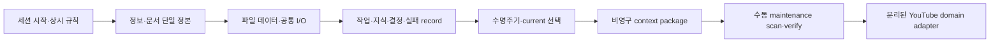

# Stage 00~09 프로젝트 구축 최종 복기 보고서

- 문서 유형: 전체 구축 시점 복기 보고서
- 작성일: 2026-07-23
- 범위: Stage 00, 01, 01.5, 02~09의 결정·구현·검증·실패·점수·커밋
- 상태: Stage 00~09 경계 커밋과 최종 보고 work·검증 완료, 독립 커밋 대기
- 현재 상태 정본: [SESSION_HANDOFF](../SESSION_HANDOFF.md)
- 구축 순서 정본: [프로젝트 계층형 구축 마스터 계획](../docs/build/MASTER_BUILD_PLAN.md)
- 실패 지식 정본: [실패 지식 색인](../failures/README.md)

## 1. 최종 결론

프로젝트는 “완성형 영상 제작 시스템을 먼저 복원”하는 접근을 중단하고, 다음 순서로 데이터 기반 지식 운영 기반을 실제 동작하게 만들었다.

1. 세션 시작과 작업별 규칙을 분리했다.
2. 정보·문서 책임과 단일 정본을 고정했다.
3. 엄격한 파일 데이터와 안전한 공통 I/O를 만들었다.
4. 작업·지식·실패·결정·수명주기를 추적 가능한 record와 event로 분리했다.
5. current 근거만 선택하는 비영구 context package로 전체 읽기 비용을 줄였다.
6. drift·중복·링크·schema·비용을 수동 fail-closed 명령으로 검증했다.
7. 첫 도메인 소비자로 유튜브 촬영 전 근거 패키지 한 작업을 연결해 실제 결과와 지식 환류 경계를 검증했다.

Stage 09 경계에서 누적 95개 테스트, 활성 Markdown 80개·링크 628개·Python 14개·schema 13개가 통과했다. 실제 유튜브 evidence pack은 current knowledge/source와 문서 각 1건을 선택해 3,690 Unicode 문자·6,028 UTF-8 bytes로 구성됐고 Stage 08 기준선보다 98.83% 작았다. 같은 입력의 두 결과와 두 fingerprint가 일치했으며 상태를 저장하지 않았다.

점수는 11개 단계 평균 97.36점, 최저 96점, 최고 98점이다. 모든 단계가 네 가지 확인을 통과했고 완료 시점의 미해결 실패는 0건이었다. 점수는 증거를 대체하지 않으며 아래 commit·work·test·실제 실행 결과가 완료 판단의 우선 근거다.

## 2. 최종 구조와 책임

| 계층 | 활성 소유자 | 하지 않는 것 |
|---|---|---|
| 세션·정책 | `AGENTS.md`, `PROJECT_RULES.md`, `SESSION_HANDOFF.md` | 매 메시지 전체 문서 재읽기, 현재 상태 복수 소유 |
| 작업 절차 | `rules/*.md` | 상시 정책 복제, 관련 없는 작업에서 강제 로딩 |
| 정보 구조 | `docs/INFORMATION_ARCHITECTURE.md` | README·Obsidian 파생 화면을 정본으로 승격 |
| 공통 데이터 | `schemas/`, `src/file_data/`, `data/records`, `data/events` | 사용자 원본 저장, 삭제·이동 진입점, domain 필드 혼합 |
| 실패 지식 | `failures/*.md` + hash-verified projection | 단계별 본문 복제, 원인 미확인 실패의 해결 표시 |
| 선택 컨텍스트 | `ContextService`와 비영구 package | 전체 자동 로딩, package 저장, candidate·superseded 기본 선택 |
| 유지보수 | `MaintenanceService`와 generated inventory | Hook·CI·예약·자동 병합·삭제·current 채택 |
| 첫 도메인 | `src/youtube_domain/`, 유튜브 계약·schema | 전체 제작, 외부 앱, 보호 원본, 창작 자동 승인 |

## 3. 단계별 구축 결과

| 단계 | 점수 | 핵심 결과 | 경계 커밋 |
|---:|---:|---|---|
| 00 | 96 | 세션 시작 1회 읽기, 상시·작업 규칙 분리, 실패 지식 폴더, 네 가지 확인·100점 게이트 | `8dc034e` |
| 01 | 98 | 권위 역할·문서 유형 분리, 단일 소유자, 배치·생성·보존 계약 | `0601489` 누적 |
| 01.5 | 98 | 프로젝트 루트 Obsidian 볼트, 시작 화면·전체 지도·단계 보기, 보호 제외 | `0601489` 누적 |
| 02 | 98 | 공통 record 외피, UUIDv4 단일 주소, strict UTF-8/JSON/hash, 원자 저장, 13개 테스트 | `0601489` 누적 |
| 03 | 98 | `RecordStore`, UTF-8 JSON CLI, expected hash 갱신, 원자 JSONL append, 오류 상태 2~8, 25개 테스트 | `0601489` |
| 04 | 98 | immutable request, append-only work event, replay snapshot, 상태 전이·재개, 36개 테스트 | `519ff30` |
| 05 | 97 | source→knowledge→decision→failure projection 순차 도입, 55개 테스트 | `b9ef127` |
| 06 | 97 | candidate/current/review/superseded/rejected/retired, 승인 전이, conflict·audit·rebuild, 68개 테스트 | `93c516e` |
| 07 | 97 | 직접 문서·current record·필터·문자열 후보, 선택·제외·비용·fingerprint, 79개 테스트 | `a383bbd` |
| 08 | 97 | read-only scan, fail-closed verify, 결정론 inventory, 입력 기반 context 재평가, 87개 테스트 | `73c9435` |
| 09 | 97 | 별도 YouTube evidence adapter, 실제 domain work, `review_required`, candidate 환류, 95개 테스트 | `825e9ab` |

Stage 01~03은 사용자가 승인한 누적 경계 커밋 하나로 닫았고 Stage 04부터는 단계마다 독립 커밋했다. Stage 08부터는 사용자 최신 지시에 따라 성공 게이트 뒤 커밋 검증을 마쳐야 다음 단계나 최종 보고 작업으로 이동했다.

## 4. 중요한 결정의 복기

### 4.1 읽기 규칙

- 새 세션 시작 시 `AGENTS.md` → `PROJECT_RULES.md` → `SESSION_HANDOFF.md`를 한 번 읽는다.
- 매 메시지마다 반복하지 않는다. 규칙·현재 상태 변경 알림이 있을 때만 다시 읽는다.
- 특정 행동을 시작할 때만 `AGENTS.md`가 가리키는 관련 `rules/*.md`를 읽는다.
- 단계 계획은 이전 단계의 성공 게이트와 경계 커밋을 확인한 뒤 읽는다.

이 분리로 항상 필요한 안전·권위 경계와 Git·문서·실패·보호 데이터 같은 조건부 절차의 인지 비용을 구분했다.

### 4.2 단일 정본과 파생물

- 현재 상태는 `SESSION_HANDOFF.md`, 작업 사실은 append-only event, 현재 work는 재구축 가능한 snapshot이 소유한다.
- Markdown 실패 사례가 정본이고 `failure_knowledge`는 경로·hash가 맞을 때만 유효한 projection이다.
- Obsidian 지도·generated inventory·context package는 정본을 대체하지 않는다.
- 바뀐 source·projection·knowledge는 기존 record를 지우지 않고 replacement를 current로 고른다.

### 4.3 기록과 지식

- 작업 중 발생한 모든 사실을 자동 장기 지식으로 승격하지 않는다.
- source, fact/procedure/constraint/inference knowledge, decision, resolved failure를 구분한다.
- candidate는 current 검색과 기본 도메인 입력에서 제외한다.
- current·supersede·reject·retire는 사용자 또는 standing policy 승인 경계를 지킨다.

### 4.4 컨텍스트와 비용

- 직접 선택 → 실제 필드 filter → current 문자열 후보 순서를 사용한다.
- 대표 package는 12,000자 이하, 전체 활성 Markdown 기준선 대비 85% 이상 절감을 목표로 했다.
- Stage 08 최종 대표 평가에서 기존·신규·실패 package는 모두 96% 이상 절감했고 필수 누락·금지·무관 결과가 0이었다.
- 고급 FTS·벡터·그래프는 실제 필요가 증명되지 않아 도입하지 않았다.

### 4.5 자동화 경계

- 자동화는 사용자가 시작하는 수동 명령으로 제한했다.
- scan·verify·evaluate는 상태를 바꾸지 않고 inventory `--write`만 파생 파일 하나를 교체한다.
- Hook·CI·예약·자동 병합·삭제·current 변경은 구현하지 않았다.
- Stage 09에서 미추적 중첩 문서와 별도 Python 패키지가 추가되자 inventory와 AST 검증 범위를 일반화했다.

### 4.6 첫 도메인

- 활성 요구사항이 기반 이후 첫 소비자로 반복 지목한 유튜브 제작을 선택했다.
- 전체 영상 제작 대신 current evidence를 촬영 전에 모으는 한 작업만 구현했다.
- 예시 작업 제목은 검증 입력이며 사용자 제작 승인으로 간주하지 않는다.
- 결과는 항상 user-owned `review_required`; 대본·썸네일·촬영·편집·게시·외부 앱은 제외했다.
- 검증된 절차는 current가 아닌 knowledge candidate로만 환류했다.

## 5. 실제 대표 흐름

### 5.1 세션 재개

새 세션은 시작 문서 세 개만으로 현재 목적, 단계, work ID·hash, 실패, 첫 행동, 보호 경계를 재구성할 수 있다. `backup/`과 채팅 기억은 필수 입력이 아니다.

### 5.2 작업 기록

요청을 immutable payload로 만들고 `requested → in_progress → completed` event를 append한 뒤 snapshot을 replay한다. expected hash가 다르거나 terminal 상태 불변식을 위반하면 event 추가 전에 거부한다.

### 5.3 지식 개정

local source bytes가 바뀌면 scan이 source와 의존 knowledge drift를 읽기 전용으로 찾는다. 새 source·knowledge를 만든 뒤 current로 승인하고 이전 record를 `superseded_by`와 함께 보존한다.

### 5.4 실패 재사용

해결된 실패 Markdown을 원인별로 갱신하고 새 hash의 source·failure projection을 만든다. 같은 원인은 새 문서를 만들지 않고 재발 이력에 병합한다. Stage 07·08 평가에서는 Windows UTF-8 pipe 실패를 current failure knowledge로 다시 찾았다.

### 5.5 첫 유튜브 작업

명시 요청 → domain 입력 검증 → 공통 current context 선택 → direct record 완전성 확인 → user `review_required` gate → 두 fingerprint → 비영구 stdout 순서로 실행했다. Domain work `82dee601-21d1-400a-8d0e-98bc8f32c0ea`는 `completed`이며 pack fingerprint는 `sha256:b3785135d4ac6da210f22d177f084f63ac6878910a644521e415c9515cc040fc`다.

## 6. 실패를 통해 바뀐 것

실패는 단계 문서에 장문 복제하지 않고 [실패 지식 색인](../failures/README.md)의 원인별 정본에 보존했다.

| 구간 | 대표 실패 | 해결 후 바뀐 원칙·구현 |
|---|---|---|
| 00~01.5 | 목적 과대 해석, 형식적 승인, stale handoff, Windows 링크·경로·sandbox 가정 | 기반 우선, 영향 포함 승인, 현재 상태 단일 정본, 실제 환경 검증 |
| 02 | 시스템 Python 경로 가정, ID와 저장 주소 분리 | workspace runtime 발견, `records/<uuid>.json` 단일 주소 |
| 03 | Windows UTF-8 stdio, write 후 lock 경쟁, 저장 유형 승인 우회, 구조 정본 누락 | UTF-8 stdin 계약, 잠금 검증, 저장 record 재검증, README·정보 구조 동시 갱신 |
| 04 | event 시각 역행, native JSON 따옴표 손실 | event 시간 불변식, stdin JSON 우선, replay 복구 |
| 05 | in-progress checkpoint 부재, 한 source drift의 전체 목록 실패, fixture·API 구조 가정 | 같은 상태 checkpoint 전이, 항목별 검증, 공개 API·객체 선관찰 |
| 06~07 | Windows `rg` 와일드카드, PowerShell pipe 한글 손상, newline 실제 크기 불일치 | `rg -g`, `$OutputEncoding` UTF-8, bytes 기준 측정, 손상 record 보존 대체 |
| 08 | CLI 옵션명 가정, 기존 bytecode cache, completed work에 next action | 하위 명령 help 선확인, cache 별도 청결 검사, terminal work `next_action: null` |
| 09 | untracked 디렉터리 축약, 새 domain Python AST 누락, 예상 stderr의 Stop 승격 | `--untracked-files=all`, `src/**/*.py`, 실패 경로 exit code 직접 판정 |
| 최종 보고 | 단계 표를 literal `Stage 01.5` 문구로 검사 | 실제 `01.5` 점수 행 pattern과 전체 단계 행 11개 count로 교차검사 |

최고 연속 실패 3회가 발생한 구간에서도 기록 후 접근법을 바꿔 승인 범위 안에서 재개했다. 해결이 성공 검증되지 않은 실패를 장기 지식에서 해결로 표시하지 않았고, 단계 종료 때마다 미해결 실패 0을 확인했다.

## 7. 검증의 성장

| 경계 | 누적 자동 테스트 | 실제 추가 검증 |
|---:|---:|---|
| Stage 02 | 13 | Unicode·공백 경로, invalid UTF-8·NUL·중복 key, 원자 교체 실패 |
| Stage 03 | 25 | CLI 정상/오류 상태, expected hash, lock·stream 손상 |
| Stage 04 | 36 | 실제 work 전체 전이와 event replay |
| Stage 05 | 55 | source·knowledge·decision·failure 정합성·projection hash |
| Stage 06 | 68 | lifecycle 승인·conflict·drift·대체·rebuild |
| Stage 07 | 79 | 필수·금지·무관·크기·절감·fingerprint 대표 package |
| Stage 08 | 87 | scan·verify·inventory 삭제 재생성·비용·재평가 |
| Stage 09 | 95 | domain request·pack·current 완전성·보호 경계·비영구 CLI |

문서·코드·데이터의 최종 게이트는 strict UTF-8, NUL·후행 공백, 로컬 링크, Python AST, JSON schema parse, 보호 변경, drift, exact current duplicate, inventory bytes, runtime 경고, cache를 검사한다.

## 8. 점수 복기

| 점수 구간 | 해당 단계 | 공통 이유 |
|---|---|---|
| 98 | 01, 01.5, 02, 03, 04 | 핵심 계약·기능·실제 회귀가 완결됐고 잔여 위험이 자동화·규모 확장에 한정 |
| 97 | 05, 06, 07, 08, 09 | 기능은 완료됐지만 선형 순회, 명시 분기, 수동 승인·입력, 이중 schema 같은 유지비를 정직하게 감점 |
| 96 | 00 | 초기 문서·검증 경계는 완성했으나 당시 앱 직접 검토·커밋 범위 잔여 위험을 감점 |

감점은 후속 구현을 강제하는 미완료 목록이 아니다. 현재 범위에서 고칠 결함은 먼저 고쳤고, 남은 항목은 실제 비용이나 새 사용자 작업이 발생하기 전에는 선행 구현하지 않는 승인된 잔여 위험이다.

## 9. 현재 사용 방법

PowerShell에서 repository root를 기준으로 workspace Python과 `PYTHONPATH=src`, `PYTHONUTF8=1`, `PYTHONDONTWRITEBYTECODE=1`을 사용한다.

| 목적 | 명령 |
|---|---|
| 최신성·중복·비용 | `python -m file_data maintenance-scan` |
| 구조·링크·schema·보호 검증 | `python -m file_data maintenance-verify` |
| 파생 문서 inventory 재생성 | `python -m file_data maintenance-inventory --write` |
| current 검색 | `python -m file_data context-search --text <문구>` |
| 비영구 context package | `python -m file_data context-build --request-stdin` |
| 유튜브 evidence pack | `python -m youtube_domain --root . evidence-pack --request-stdin` |
| 전체 회귀 | `python -m unittest discover -s tests` |

도메인 example은 `examples/youtube/stage09-foundation-evidence.request.json`이다. 실제 사용자 원본을 다룰 때는 이 예시를 운영 원본으로 덮어쓰지 않고 `rules/user-data-work.md`와 정확한 사용자 지정 범위를 먼저 적용한다.

## 10. 잔여 위험과 의도적 미구현

- 실제 사용자 영상 원본, 채널 데이터, YouTube Studio, Premiere 같은 외부 앱은 검증하지 않았다.
- 유튜브 작업 제목과 창작 방향은 `review_required`이며 사용자가 승인하지 않았다.
- lifecycle·context·maintenance 탐색은 현재 규모에서 선형이고 JSONL은 전체 원자 재작성이다.
- Python runtime 제약과 JSON schema가 일부 필드를 이중 표현한다.
- domain pack은 full context를 stdout으로 반환하므로 외부 저장·전송은 별도 승인 대상이다.
- candidate 지식은 current 검색에 포함되지 않으며 자동 승격하지 않는다.
- Hook·CI·예약·DB·FTS·벡터·그래프·자동 삭제는 실제 필요와 별도 승인 전까지 미구현이다.
- Obsidian은 URI 기반 실제 앱 이동을 검증했지만 모든 사용자 마우스 탐색 경로를 독립 관찰하지 않았다.

이 위험들은 숨은 완료 조건이 아니라 현재 계약에 명시된 경계다. 다음 기능은 실제 작업·환경·비용 근거가 생길 때 새 승인 범위로 정의한다.

## 11. 최종 상태와 다음 선택

Stage 00~09 구현은 완료됐고 추가 기능 단계는 자동 시작하지 않는다. 최종 보고 work를 완료하고 이 문서를 독립 커밋한 뒤 사용자가 다음 중 하나를 새로 선택할 수 있다.

- 현재 기반을 운영하며 실제 비용·실패를 측정
- 유튜브 촬영 전 근거 패키지의 작업 제목·창작 방향 검토
- 같은 도메인의 다음 한 작업 승인
- 공통 기반의 측정된 결함 보완
- 다른 도메인 연결
- 프로젝트 구축 종료 상태 유지

권장 기본값은 **운영 측정 상태 유지**다. 실제 사용 증거 없이 다음 기능을 미리 늘리지 않는다.

## 12. 최종 보고 완료 게이트

- 활성 Markdown 81개·링크 636개·Python 14개 AST·schema 13개 parse: 오류 0
- generated inventory 10,748 bytes 일치, drift 0, exact current duplicate 0, scan 약 2.0초
- 누적 95개 회귀: 19.946초, 실패 0
- lifecycle·work event: 검증 전후 hash 불변
- cache·보호 경계 변경: 0
- 최종 보고 work: `763e0e85-d729-43a4-b83f-8b218b5b661d`, `completed`, snapshot `sha256:c083e8e05bcc8cf9b368c023ce92adfd343863be8269b82453de2d0cd468c7e5`
- 보고서 자체 점검: 단계 11개·점수 11개·경계 커밋·실패 원인별 링크·잔여 위험·다음 선택 포함
- 최종 판정: **완료 준비 — 독립 커밋 대기**
